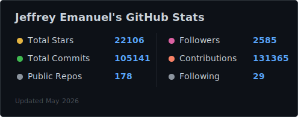
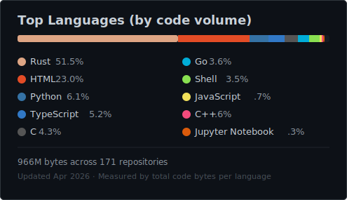
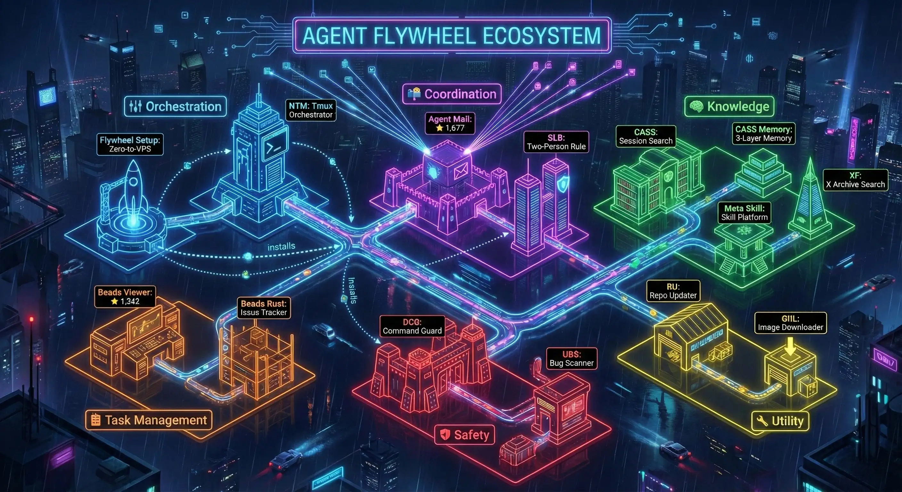

<div align="center">

# Jeffrey Emanuel


**New York** · Builder & engineer · Former long/short equity analyst


*Building the tooling that lets dozens of AI agents ship complex projects in days.*


[](https://www.jeffreyemanuel.com)
[](https://jeffreysprompts.com)
[](https://agent-flywheel.com)
[](https://brennerbot.org)
[](https://frankentui.com)

`Multi-Agent Coordination` · `Agentic Coding` · `Rust CLI Tools` · `LLM Applications` · `Terminal UI`

</div>

<p align="center">
<a href="#the-agentic-coding-flywheel">Flywheel</a> · <a href="#what-im-building-now">Building Now</a> · <a href="#open-source-highlights">Open Source</a> · <a href="#the-nvidia-short-thesis">Nvidia Thesis</a> · <a href="#writing">Writing</a> · <a href="#products">Products</a> · <a href="#philosophy">Philosophy</a> · <a href="#connect">Connect</a>
</p>

<p align="center">
  <picture>
    <source media="(prefers-color-scheme: light)" srcset="stats-light.svg" />
    <source media="(prefers-color-scheme: dark)" srcset="stats.svg" />
    
  </picture>
  <picture>
    <source media="(prefers-color-scheme: light)" srcset="languages-light.svg" />
    <source media="(prefers-color-scheme: dark)" srcset="languages.svg" />
    
  </picture>
</p>

---

## The Agentic Coding Flywheel

A self-reinforcing ecosystem of 14 tools for multi-agent software development. Agents coordinate via mail, track work via beads, search past sessions, guard against destructive mistakes, and orchestrate across tmux panes. Each tool amplifies the others. The whole thing started in October 2025 and the shipping cadence accelerates with every addition.

<p align="center">
  
</p>

| Tool | Stars | Lang | Purpose |
|:-----|:-----:|:----:|:--------|
| [**MCP Agent Mail**](https://github.com/Dicklesworthstone/mcp_agent_mail) |  |  | Gmail for coding agents: messaging, file leases, audit trails |
| [**Beads Viewer**](https://github.com/Dicklesworthstone/beads_viewer) |  |  | PageRank-powered task prioritization in a keyboard-driven TUI |
| [**Flywheel Setup**](https://github.com/Dicklesworthstone/agentic_coding_flywheel_setup) |  |  | Zero to fully-configured agentic VPS in 30 minutes |
| [**Beads Rust**](https://github.com/Dicklesworthstone/beads_rust) |  |  | Local-first, non-invasive issue tracker for git repos |
| [**DCG**](https://github.com/Dicklesworthstone/destructive_command_guard) |  |  | SIMD-accelerated guard that blocks `rm -rf` and `git reset --hard` |
| [**CASS**](https://github.com/Dicklesworthstone/coding_agent_session_search) |  |  | Unified search across 11+ AI coding tool histories |
| [**CASS Memory**](https://github.com/Dicklesworthstone/cass_memory_system) |  |  | Three-layer cognitive memory: episodic, working, procedural |
| [**UBS**](https://github.com/Dicklesworthstone/ultimate_bug_scanner) |  |  | 1,000+ pattern-based bug scanner, runs before every commit |
| [**NTM**](https://github.com/Dicklesworthstone/ntm) |  |  | Multi-agent tmux orchestration with animated dashboards |
| [**Meta Skill**](https://github.com/Dicklesworthstone/meta_skill) |  |  | Skill management platform with CASS mining and MCP server |
| [**XF**](https://github.com/Dicklesworthstone/xf) |  |  | Sub-millisecond search over X/Twitter data archives |
| [**SLB**](https://github.com/Dicklesworthstone/slb) |  |  | Two-person rule: peer approval before dangerous commands |
| [**RU**](https://github.com/Dicklesworthstone/repo_updater) |  |  | Keep hundreds of Git repos in sync with one command |
| [**GIIL**](https://github.com/Dicklesworthstone/giil) |  |  | Download full-res images from iCloud/Dropbox share links |

### Quick Install

> [!TIP]
> **Full ecosystem** (Ubuntu VPS):
> ```bash
> curl -fsSL "https://raw.githubusercontent.com/Dicklesworthstone/agentic_coding_flywheel_setup/main/install.sh" | bash -s -- --yes --mode vibe
> ```
> **Individual Rust tools** via Cargo:
> ```bash
> cargo install xf  # xf — X/Twitter archive search
> ```
> Other Flywheel tools (CASS, DCG, Beads Rust) install from source via the Flywheel Setup script or `cargo install --git`.

### Agent Mail in Action

<p align="center">
  
</p>

---

## What I'm Building Now

| Project | Lang | What it does |
|:--------|:----:|:-------------|
| [**FrankenSQLite**](https://github.com/Dicklesworthstone/frankensqlite) |  | Clean-room SQLite reimplementation with MVCC page-level versioning and RaptorQ erasure codes |
| [**FrankenTUI**](https://github.com/Dicklesworthstone/frankentui) |  | Minimal, deterministic terminal UI kernel — the rendering layer for CASS and other Rust TUI tools |
| [**FrankenTerm**](https://github.com/Dicklesworthstone/frankenterm) |  | Terminal hypervisor for AI agent swarms: pattern detection, event automation, multiplexed I/O |
| [**Bio-Inspired Nanochat**](https://github.com/Dicklesworthstone/bio_inspired_nanochat) |  | What if a Transformer had a metabolism? Living weights with synaptic fatigue and structural plasticity |

---

## Open Source Highlights

### AI & LLM Tools

- 📄 **[LLM-Aided OCR](https://github.com/Dicklesworthstone/llm_aided_ocr)**  🔥 — Tesseract + language models = perfect PDFs. Corrects OCR errors that regex rules never catch.
- 🦙 **[Swiss Army Llama](https://github.com/Dicklesworthstone/swiss_army_llama)**  — High-performance FastAPI service for local LLM inference and semantic search.
- 📋 **[Your Source to Prompt](https://github.com/Dicklesworthstone/your-source-to-prompt.html)**  🔥 — Secure, browser-based tool that turns codebases into optimized LLM prompts.
- 🎥 **[Bulk YouTube Transcriber](https://github.com/Dicklesworthstone/bulk_transcribe_youtube_videos_from_playlist)**  — Convert entire playlists into structured, searchable text with Whisper.
- 🤖 **[Claude Code Agent Farm](https://github.com/Dicklesworthstone/claude_code_agent_farm)**  🔥 — Orchestrate parallel Claude Code agents to autonomously improve codebases across 34 tech stacks.
- 🧠 **[Mindmap Generator](https://github.com/Dicklesworthstone/mindmap-generator)**  — Distills documents into hierarchical, context-aware mindmaps using non-linear exploration.
- 🔗 **[Ultimate MCP Client](https://github.com/Dicklesworthstone/ultimate_mcp_client)**  — Universal bridge for AI models to interact with the real world via MCP.
- 🔌 **[Ultimate MCP Server](https://github.com/Dicklesworthstone/ultimate_mcp_server)**  — Unified MCP server exposing dozens of tools to frontier models.
- 🌐 **[Markdown Web Browser](https://github.com/Dicklesworthstone/markdown_web_browser)**  — Headless browser that renders modern JavaScript-heavy sites into clean Markdown for agents.

### Systems & Rust

- ⚡ **[Fast Vector Similarity](https://github.com/Dicklesworthstone/fast_vector_similarity)**  🔥 — High-speed Rust library for complex vector similarity metrics with Python bindings.
- 🔬 **[FrankenTUI](https://github.com/Dicklesworthstone/frankentui)**  — Minimal, high-performance terminal UI kernel. The rendering substrate for CASS and other Rust TUI applications in the Flywheel.
- 🗄️ **[FrankenSQLite](https://github.com/Dicklesworthstone/frankensqlite)**  — Clean-room Rust reimplementation of SQLite with MVCC page-level versioning and RaptorQ erasure codes.
- 🖥️ **[FrankenTerm](https://github.com/Dicklesworthstone/frankenterm)**  — Terminal hypervisor for AI agent swarms with pattern detection and event-driven automation.
- 🦀 **[Fast CMA-ES](https://github.com/Dicklesworthstone/fast_cmaes)**  — SIMD-accelerated, Rayon-parallelized evolution strategy optimizer in Rust.
- 🦎 **[Rust ScriptBots](https://github.com/Dicklesworthstone/rust_scriptbots)**  — Deterministic, GPU-accelerated artificial life simulator. Modern Rust reimplementation of Karpathy's ScriptBots.
- 🔍 **[UltraSearch](https://github.com/Dicklesworthstone/ultrasearch)**  — Instant file search engine for Windows using NTFS USN journals and Tantivy. A modern "Everything" in Rust.

### Research & Science

- 🧬 **[Bio-Inspired Nanochat](https://github.com/Dicklesworthstone/bio_inspired_nanochat)**  — What if a Transformer had a metabolism? Living weights with synaptic fatigue and structural plasticity.
- 🔢 **[Model-Guided Research](https://github.com/Dicklesworthstone/model_guided_research)**  — 11 exotic math frameworks for AI (Lie group attention, p-adic spaces, tropical geometry), designed with frontier models.
- 🛡️ **[ACIP](https://github.com/Dicklesworthstone/acip)**  — AI Cognitive Inoculation Protocol: defense against prompt injection via external monitoring.
- 🔬 **[Brenner Bot](https://github.com/Dicklesworthstone/brenner_bot)**  — Multi-agent research system embodying Sydney Brenner's scientific methodology.
- 🧮 **[LLM Introspective Compression](https://www.jeffreyemanuel.com/writing/llm_introspective_compression)** — Treating LLM context as a save state: reasoning backtracking and metacognitive control.
- 🦠 **[Phage Explorer](https://github.com/Dicklesworthstone/phage_explorer)**  — Interactive educational site exploring bacteriophages with 3D visualization.

### Developer Tools

- 📊 **[SQLAlchemy Visualizer](https://github.com/Dicklesworthstone/sqlalchemy_data_model_visualizer)**  — Instantly turn SQLAlchemy ORM models into interactive SVG diagrams.
- 📝 **[Automatic Log Collector](https://github.com/Dicklesworthstone/automatic_log_collector_and_analyzer)**  — Open-source Splunk alternative for multi-server log aggregation and analysis.
- 💡 **[Coding Agent Tips](https://github.com/Dicklesworthstone/misc_coding_agent_tips_and_scripts)**  — Battle-tested solutions for AI coding agent workflows and terminal setup.
- 📦 **[Coding Agent Account Manager](https://github.com/Dicklesworthstone/coding_agent_account_manager)**  — Sub-100ms auth switching across Claude Max, GPT Pro, and Gemini subscriptions.
- 🔄 **[Flywheel Connectors](https://github.com/Dicklesworthstone/flywheel_connectors)**  — Secure integration adapters for external services in the Flywheel ecosystem.
- 🏗️ **[Pi Agent Rust](https://github.com/Dicklesworthstone/pi_agent_rust)**  — High-performance AI coding agent CLI with sub-100ms startup and native SSE streaming.
- ☁️ **[Cloud Benchmarker](https://github.com/Dicklesworthstone/cloud_benchmarker)**  — Automated cloud instance benchmarking with charts and historical tracking.

### Education & Visualization

- 🌀 **[Visual A* Pathfinding](https://github.com/Dicklesworthstone/visual_astar_python)**  — Cinematic, animated visualizations of pathfinding algorithms in action.
- ⏱️ **[Introduction to Temporal Logic](https://github.com/Dicklesworthstone/introduction_to_temporal_logic)**  — How temporal logic can be used to analyze concurrency.
- 📐 **[Hoeffding's D Explainer](https://github.com/Dicklesworthstone/hoeffdings_d_explainer)**  — The non-parametric dependency measure that catches what Pearson and Spearman miss.
- 🍞 **[Lamport's Bakery Algorithm](https://github.com/Dicklesworthstone/bakery_algorithm)**  — Visual Pythonic implementation of fair mutual exclusion without atomic hardware.
- 🧮 **[CMA-ES Explainer](https://github.com/Dicklesworthstone/cmaes_explainer)**  — Interactive deep dive into the evolution strategy that works where gradient descent fails.
- 🏰 **[Kissinger Thesis Reader](https://github.com/Dicklesworthstone/kissinger_undergraduate_thesis)**  — A reader for Henry Kissinger's 400-page undergraduate thesis on the meaning of history.

### More Projects

- 📰 **[Next.js GitHub Blog](https://github.com/Dicklesworthstone/nextjs-github-markdown-blog)**  — Blogging platform that uses GitHub as a headless CMS
- 📝 **[JeffreysPrompts.com](https://github.com/Dicklesworthstone/jeffreysprompts.com)**  — Curated prompt library for agentic coding workflows
- 📚 **[LLM Docs](https://github.com/Dicklesworthstone/llm-docs)**  — Documentation optimized for LLM consumption
- 📐 **[Grassmann Article](https://www.jeffreyemanuel.com/writing/hermann_grassmann_nature_of_abstractions)** — The story of the self-taught genius who invented linear algebra decades early
- 🏆 **[LLM Tournament](https://github.com/Dicklesworthstone/llm_multi_round_coding_tournament)**  — Arena where LLMs compete and iterate on coding challenges via peer review
- 🧩 **[Clawdbot Skills](https://github.com/Dicklesworthstone/agent_flywheel_clawdbot_skills_and_integrations)**  — Modular skill library teaching agents to use the Flywheel toolkit
- 🔁 **[Automated Plan Reviser](https://github.com/Dicklesworthstone/automated_plan_reviser_pro)**  — Iterative specification refinement using extended reasoning models
- 🗣️ **[The Lighthill Debate on AI](https://github.com/Dicklesworthstone/the_lighthill_debate_on_ai)**  — Full transcript of the 1973 debate that nearly killed British AI research
- 🎬 **[YouTube Transcript Cleaner](https://github.com/Dicklesworthstone/youtube_transcript_cleaner)**  — Clean up raw YouTube auto-captions into readable text
- 📡 **[Remote Compilation Helper](https://github.com/Dicklesworthstone/remote_compilation_helper)**  — Transparent build offloading for AI agents via Claude Code hooks
- 🛡️ **[System Resource Protection](https://github.com/Dicklesworthstone/system_resource_protection_script)**  — Intelligent resource guardrails that prevent dev tools from freezing your Linux desktop
- 🔄 **[ASupersync](https://github.com/Dicklesworthstone/asupersync)**  — Spec-first, cancel-correct, capability-secure async runtime for Rust
- 💡 **[Anti-Alzheimer's Flasher](https://github.com/Dicklesworthstone/anti_alzheimers_flasher)**  — Web-based 40Hz neural stimulation tool
- 💬 **[Chat to File](https://github.com/Dicklesworthstone/chat_shared_conversation_to_file)**  — Convert ChatGPT, Gemini, and Grok share links to clean Markdown
- 📦 **[PrepareProjectForLLMPrompt](https://github.com/Dicklesworthstone/prepareprojectforllmprompt)**  — Flatten a codebase into a single LLM-ready prompt

---

## The Nvidia Short Thesis

In January 2025, I published a [12,000-word analysis](https://www.jeffreyemanuel.com/writing/the_short_case_for_nvda) arguing that DeepSeek and the economics of AI inference would collide with Nvidia's valuation narrative. Within days, roughly $600 billion in market cap evaporated.

<table>
<tr>
<td width="120" align="center">
<a href="https://x.com/naval"></a>
</td>
<td><em>"Come for the trade, stay for the dazzling 60-minute education on the state of AI."</em></td>
</tr>
<tr>
<td align="center">
<a href="https://www.bloomberg.com/opinion/authors/ARbTQlRLRjE/matthew-s-levine"></a>
</td>
<td><em>"A candidate for the most impactful short research report ever written."</em></td>
</tr>
<tr>
<td align="center">
<a href="https://simonwillison.net/"></a>
</td>
<td><em>"Long, excellent... Jeffrey has a rare combination of experience in both computer science and investment analysis."</em></td>
</tr>
</table>

---

## Writing

Selected essays from [jeffreyemanuel.com/writing](https://www.jeffreyemanuel.com/writing):

- **[RaptorQ: The Black Magic of Liquid Data](https://www.jeffreyemanuel.com/writing/raptorq)** — Deep dive into the fountain code that turns any file into an infinite stream of interchangeable packets
- **[The Short Case for Nvidia Stock](https://www.jeffreyemanuel.com/writing/the_short_case_for_nvda)** — How AI economics, DeepSeek, and GPU supply collide with valuation narratives
- **[The Most Impressive Prediction of All Time](https://www.jeffreyemanuel.com/writing/the_most_impressive_prediction_of_all_time)** — Pyotr Durnovo's 1914 memo that predicted WWI, its alliances, and the Russian Revolution
- **[The Lessons of Hermann Grassmann](https://www.jeffreyemanuel.com/writing/hermann_grassmann_nature_of_abstractions)** — The self-taught genius who invented linear algebra decades before it was understood
- **[Factor Risk Models and the Hedge Fund Business](https://www.jeffreyemanuel.com/writing/barra_factor_model_article)** — How "smart" risk models distort incentives and create hidden systemic risk
- **[PPP Loan Fraud: A Data Science Detective Story](https://www.jeffreyemanuel.com/writing/ppp_loan_fraud_analysis)** — Network analysis that could have caught billions in theft
- **[Making Complex Code Changes with Claude Code](https://www.jeffreyemanuel.com/writing/making_complex_code_changes_with_cc)** — Separating cognition: use agents for plans first, code second
- **[Some Thoughts on AI Alignment](https://www.jeffreyemanuel.com/writing/some_thoughts_on_ai_alignment)** — Why internal alignment fails and AI needs an external criminal justice system

---

## GitHub Activity


<p align="center">
  <a href="https://star-history.com/#Dicklesworthstone/mcp_agent_mail&Dicklesworthstone/llm_aided_ocr&Dicklesworthstone/beads_viewer&Dicklesworthstone/agentic_coding_flywheel_setup&Dicklesworthstone/your-source-to-prompt.html&Date">
    
  </a>
</p>

---

## Products

- 🌐 **[jeffreyemanuel.com](https://www.jeffreyemanuel.com)** — Personal site built with Next.js 16, React Three Fiber, and GSAP. 70 components, 3D WebGL hero, 21 essays, 90+ project showcase.
- 📝 **[JeffreysPrompts.com](https://jeffreysprompts.com)** — Battle-tested prompts for AI coding agents. Browse, copy, or install as Claude Code skills.
- ⚡ **[Agent-Flywheel.com](https://agent-flywheel.com)** — Interactive setup wizard for the complete Flywheel ecosystem
- 🔬 **[BrennerBot.org](https://brennerbot.org)** — Multi-agent research orchestration using Sydney Brenner's scientific methods
- 🖥️ **[FrankenTUI.com](https://frankentui.com)** — Minimal, deterministic terminal UI kernel for Rust TUI applications

---

## Philosophy

> [!IMPORTANT]
> The bottleneck in software isn't writing code — it's coordination. Build the right tooling and you can run a dozen frontier-model agents on the same repo at the same time, delivering in days what used to take months. That's the Flywheel thesis: every tool you add makes every agent more productive, and the compounding never stops.

---

## Recognition

- **[Naval Ravikant](https://x.com/naval)** called the Nvidia short thesis a "dazzling 60-minute education on the state of AI"
- **[Matt Levine](https://www.bloomberg.com/opinion/authors/ARbTQlRLRjE/matthew-s-levine)** (Bloomberg) called it "a candidate for the most impactful short research report ever written"
- **[Simon Willison](https://simonwillison.net/)** (creator of Datasette) praised the "rare combination of experience in both computer science and investment analysis"
- Front page of **Hacker News** (multiple times)
- Featured on **Slashdot**, the **Bankless podcast**, and picked up by analysts and fund managers worldwide
- 16,700+ GitHub stars, 1,700+ followers, 60,000+ contributions

---

## Connect

[](https://x.com/doodlestein)
[](https://github.com/Dicklesworthstone)
[](https://www.linkedin.com/in/jeffreyemanuel)
[](https://www.jeffreyemanuel.com)
[](mailto:jeffreyemanuel@gmail.com)

---

## Background

- Spent a decade as a long/short equity analyst at hedge funds in New York
- Building with deep learning since 2010, multi-agent systems since 2023
- Consult to PE firms and hedge funds on AI automation strategy
- The Flywheel ecosystem started in October 2025 and each tool accelerates the creation of the next
