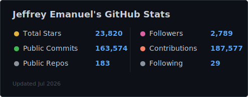
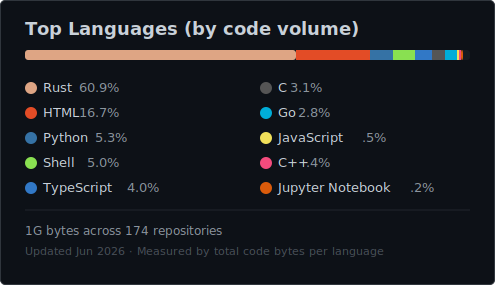
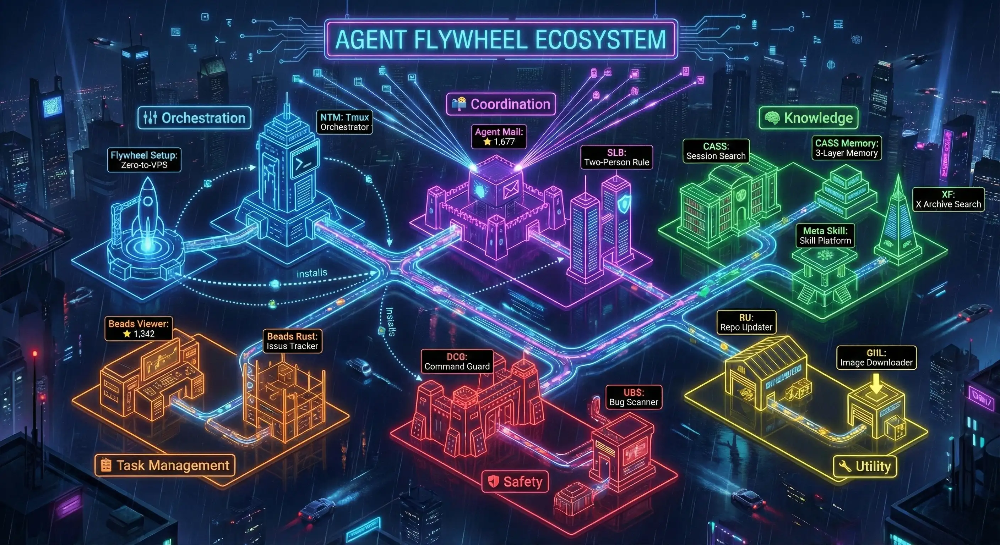

<div align="center">

# Jeffrey Emanuel


**New York** · Builder & engineer · Former long/short equity analyst


*Building the tooling that lets dozens of AI agents ship complex projects in days.*


[](https://www.jeffreyemanuel.com)
[](https://jeffreysprompts.com)
[](https://agent-flywheel.com)
[](https://brennerbot.org)
[](https://frankentui.com)
[](https://jeffreys-skills.md/)
[](https://mcpagentmail.com)
[](https://frankensqlite.com)
[](https://asupersync.com)
[](https://discord.gg/gnCHsYDR25)

`Multi-Agent Coordination` · `Agentic Coding` · `Rust CLI Tools` · `LLM Applications` · `Terminal UI` · `FrankenSuite`

</div>

<p align="center">
<a href="#the-agentic-coding-flywheel">Flywheel</a> · <a href="#the-frankensuite">FrankenSuite</a> · <a href="#what-im-building-now">Building Now</a> · <a href="#open-source-highlights">Open Source</a> · <a href="#the-nvidia-short-thesis">Nvidia Thesis</a> · <a href="#writing">Writing</a> · <a href="#products">Products</a> · <a href="#philosophy">Philosophy</a> · <a href="#connect">Connect</a>
</p>

<p align="center">
  <picture>
    <source media="(prefers-color-scheme: light)" srcset="stats-light.svg" />
    <source media="(prefers-color-scheme: dark)" srcset="stats.svg" />
    
  </picture>
  <picture>
    <source media="(prefers-color-scheme: light)" srcset="languages-light.svg" />
    <source media="(prefers-color-scheme: dark)" srcset="languages.svg" />
    
  </picture>
</p>

> [!NOTE]
> **194,570 contributions in the past year**, powered by 55 AI coding agent subscription accounts (~$12.5K/month) and the Flywheel tooling below. The vast majority landed since January 2026, when the ecosystem hit critical mass.

---

## The Agentic Coding Flywheel

A self-reinforcing ecosystem of 14 tools for multi-agent software development. Agents coordinate via mail, track work via beads, search past sessions, guard against destructive mistakes, and orchestrate across tmux panes. Each tool amplifies the others. Started October 2025; shipping cadence accelerates with every addition. Join the [Flywheel Hub Discord](https://discord.gg/gnCHsYDR25) (~1,022 members). Read the [comprehensive guide](https://agent-flywheel.com/complete-guide) or the [beginner-friendly version](https://agent-flywheel.com/core-flywheel).

<p align="center">
  
</p>

| Tool | Stars | Lang | Purpose |
|:-----|:-----:|:----:|:--------|
| [**MCP Agent Mail**](https://github.com/Dicklesworthstone/mcp_agent_mail) |  |  | Gmail for coding agents: messaging, file leases, audit trails |
| [**Beads Viewer**](https://github.com/Dicklesworthstone/beads_viewer) |  |  | PageRank-powered task prioritization in a keyboard-driven TUI |
| [**Flywheel Setup**](https://github.com/Dicklesworthstone/agentic_coding_flywheel_setup) |  |  | Zero to fully-configured agentic VPS in 30 minutes |
| [**Beads Rust**](https://github.com/Dicklesworthstone/beads_rust) |  |  | Local-first, non-invasive issue tracker for git repos |
| [**DCG**](https://github.com/Dicklesworthstone/destructive_command_guard) |  |  | SIMD-accelerated guard that blocks `rm -rf` and `git reset --hard` |
| [**CASS**](https://github.com/Dicklesworthstone/coding_agent_session_search) |  |  | Unified search across 22 AI coding tool histories |
| [**CASS Memory**](https://github.com/Dicklesworthstone/cass_memory_system) |  |  | Three-layer cognitive memory: episodic, working, procedural |
| [**UBS**](https://github.com/Dicklesworthstone/ultimate_bug_scanner) |  |  | 1,000+ pattern-based bug scanner, runs before every commit |
| [**NTM**](https://github.com/Dicklesworthstone/ntm) |  |  | Multi-agent tmux orchestration with animated dashboards |
| [**Meta Skill**](https://github.com/Dicklesworthstone/meta_skill) |  |  | Skill management platform with CASS mining and MCP server |
| [**XF**](https://github.com/Dicklesworthstone/xf) |  |  | Sub-millisecond search over X/Twitter data archives |
| [**SLB**](https://github.com/Dicklesworthstone/slb) |  |  | Two-person rule: peer approval before dangerous commands |
| [**RU**](https://github.com/Dicklesworthstone/repo_updater) |  |  | Keep hundreds of Git repos in sync with one command |
| [**GIIL**](https://github.com/Dicklesworthstone/giil) |  |  | Download full-res images from iCloud/Dropbox share links |

### Quick Install

> [!TIP]
> **Full ecosystem** (Ubuntu VPS):
> ```bash
> curl -fsSL "https://raw.githubusercontent.com/Dicklesworthstone/agentic_coding_flywheel_setup/main/install.sh" | bash -s -- --yes --mode vibe
> ```
> **Individual Rust tools** via Cargo:
> ```bash
> cargo install xf  # xf — X/Twitter archive search
> ```
> Other Flywheel tools (CASS, DCG, Beads Rust) install from source via the Flywheel Setup script or `cargo install --git`.

### Agent Mail in Action

<p align="center">
  
</p>

---

## The FrankenSuite

Clean-room Rust reimplementations of foundational software and runtimes. Each targets drop-in compatibility with the original while adding memory safety, concurrency, and in some cases entirely new capabilities.

| Project | Stars | What it reimplements |
|:--------|:-----:|:---------------------|
| [**FrankenOCR**](https://github.com/Dicklesworthstone/franken_ocr) |  | Baidu Unlimited-OCR (3B MoE VLM) on CPU in pure Rust. Five-model zoo, custom int8 kernels, no Python. |
| [**FrankenSQLite**](https://github.com/Dicklesworthstone/frankensqlite) |  | SQLite with MVCC concurrent writers and RaptorQ self-healing. 27-crate workspace. |
| [**FrankenTUI**](https://github.com/Dicklesworthstone/frankentui) |  | 1M+ lines of Rust, 20 crates, 80+ widgets. Kernel-level TUI foundation. |
| [**FrankenTerm**](https://github.com/Dicklesworthstone/frankenterm) |  | WezTerm fork extended into a swarm-native terminal platform. 77 crates, 57K+ tests. |
| [**FrankenMarkdown**](https://github.com/Dicklesworthstone/franken_markdown) |  | Markdown to HTML and tagged PDF. Zero-dependency engine: own parser, typesetter, font subsetter, PDF writer. |
| [**FrankenSearch**](https://github.com/Dicklesworthstone/frankensearch) |  | Two-tier hybrid search: HNSW ANN + Tantivy full-text + cross-encoder reranking. |
| [**FrankenEngine**](https://github.com/Dicklesworthstone/franken_engine) |  | Native Rust runtime for adversarial extension workloads. Deterministic replay, cryptographic receipts. |
| [**FrankenNode**](https://github.com/Dicklesworthstone/franken_node) |  | Trust-native JS/TS runtime on FrankenEngine. Migration autopilot, per-extension trust cards. |
| [**FrankenLibC**](https://github.com/Dicklesworthstone/frankenlibc) |  | Rust-based libc with LD_PRELOAD safety membrane. Retrofits memory safety onto any C program. |
| [**FrankenFS**](https://github.com/Dicklesworthstone/frankenfs) |  | ext4/btrfs in Rust via FUSE. Block-level MVCC + RaptorQ fountain codes for mathematical self-healing. |
| [**FrankenRedis**](https://github.com/Dicklesworthstone/frankenredis) |  | Redis reimplementation targeting full protocol parity. Deterministic Latency Replication Core. |
| [**FrankenPandas**](https://github.com/Dicklesworthstone/frankenpandas) |  | Full pandas API in Rust. Columnar storage, 14+ IO formats, 5,000+ tests. |
| [**FrankenJAX**](https://github.com/Dicklesworthstone/frankenjax) |  | JAX transform semantics (jit, grad, vmap) with JAXPR-like IR. 157 primitives, full AD, 861 oracle fixtures. |
| [**FrankenTorch**](https://github.com/Dicklesworthstone/frankentorch) |  | PyTorch reimplementation with Deterministic Autograd Contract. |
| [**FrankenNumPy**](https://github.com/Dicklesworthstone/franken_numpy) |  | NumPy in Rust. 10 crates, zero unsafe, 6,392 tests, bit-exact RNG parity. |
| [**FrankenSciPy**](https://github.com/Dicklesworthstone/frankenscipy) |  | SciPy with Condition-Aware Solver Portfolio (CASP). |
| [**FrankenMermaid**](https://github.com/Dicklesworthstone/frankenmermaid) |  | Mermaid diagram engine. 24 diagram types, deterministic layout, WASM-ready. |
| [**FrankenWhisper**](https://github.com/Dicklesworthstone/franken_whisper) |  | Whisper speech recognition in Rust. No Python dependency. |
| [**FrankenNetworkX**](https://github.com/Dicklesworthstone/franken_networkx) |  | NetworkX graph library in Rust with Python bindings. |
| [**FrankenSim**](https://github.com/Dicklesworthstone/frankensim) |  | Certified simulation substrate: geometry, numerics, meshing, solvers, optimization. 125 crates, each contract-backed. |
| [**FrankenSnowflake**](https://github.com/Dicklesworthstone/franken_snowflake) |  | The Snowflake driver Rust never had. 14 crates, SQL API direct, no ODBC or JDBC. |

---

## What I'm Building Now

<!-- BEGIN AUTO-BUILDING-NOW -->
| Project | Lang | What it does |
|:--------|:----:|:-------------|
| [**FrankenSQLite**](https://github.com/Dicklesworthstone/frankensqlite) |  | Independent ground-up Rust reimplementation of SQLite with concurrent writers and information-theoretic durability |
| [**FrankenSciPy**](https://github.com/Dicklesworthstone/frankenscipy) |  | Clean-room Rust reimplementation of SciPy with Condition-Aware Solver Portfolio (CASP) — runtime algorithm selection driven by conditioning diagnostics, stability certificates, and decision-theoretic policy controllers |
| [**FrankenOCR**](https://github.com/Dicklesworthstone/franken_ocr) |  | Pure-Rust, CPU-only OCR engine for Baidu Unlimited-OCR (a DeepSeek-OCR-derived 3B MoE VLM). Five-model zoo, custom int8 kernels, no ML framework, no Python, no GPU. |
| [**FrankenRedis**](https://github.com/Dicklesworthstone/frankenredis) |  | Memory-safe clean-room Redis reimplementation in Rust with strict/hardened compatibility modes, deterministic replication semantics, differential conformance harnesses, and profile-guided optimization proofs. |
| [**FrankenFS**](https://github.com/Dicklesworthstone/frankenfs) |  | Memory-safe FUSE reimplementation of ext4 and btrfs in Rust with block-level MVCC and RaptorQ self-healing. 19-crate workspace, zero unsafe code. |
| [**FrankenSim**](https://github.com/Dicklesworthstone/frankensim) |  | Plan-first Rust continuum for certified geometry, physics simulation, optimization, and rendering. |
| [**FrankenNode**](https://github.com/Dicklesworthstone/franken_node) |  | Trust-native JavaScript/TypeScript runtime platform built on franken_engine with deterministic compatibility, migration autopilot, extension trust controls, and incident replay. |
| [**FrankenNetworkX**](https://github.com/Dicklesworthstone/franken_networkx) |  | Memory-safe clean-room Rust reimplementation of NetworkX with deterministic graph semantics, differential conformance, and RaptorQ-backed durability. |
| [**FrankenWhisper**](https://github.com/Dicklesworthstone/franken_whisper) |  | Agent-first Rust ASR orchestration stack: Bayesian backend routing across whisper.cpp/insanely-fast-whisper/whisper-diarization, real-time NDJSON streaming, SQLite persistence, TTY audio transport, conformance harness. 107K lines, 2000+ tests, zero unsafe code. |
| [**FrankenMermaid**](https://github.com/Dicklesworthstone/frankenmermaid) |  | Rust-first Mermaid-compatible diagram engine with smarter parsing, deterministic layouts, and high-quality output across CLI, SVG, terminal, and WASM targets |
| [**FrankenLibC**](https://github.com/Dicklesworthstone/frankenlibc) |  | Rust interposition layer for glibc: transparent safety membrane that incrementally replaces C library functions with memory-safe Rust implementations |
| [**FrankenSnowflake**](https://github.com/Dicklesworthstone/franken_snowflake) |  | Clean-room, Rust-first, Asupersync-native Snowflake SQL API connector built for coding agents. 14-crate workspace, live reads and writes, no ODBC or JDBC. |
<!-- END AUTO-BUILDING-NOW -->

### Live Demos

<table>
<tr>
<td align="center" width="33%">
<a href="https://frankentui.com/web"></a><br/>
<a href="https://frankentui.com/web"><strong>FrankenTUI — Web Demo</strong></a><br/>
<sub>Pure TypeScript terminal UI running in the browser</sub>
</td>
<td align="center" width="33%">
<a href="https://frankentui.com/web_react"></a><br/>
<a href="https://frankentui.com/web_react"><strong>FrankenTUI — React Demo</strong></a><br/>
<sub>React component wrapper for FrankenTUI widgets</sub>
</td>
<td align="center" width="33%">
<a href="https://frankensqlite.com/"></a><br/>
<a href="https://frankensqlite.com/"><strong>FrankenSQLite</strong></a><br/>
<sub>Clean-room Rust version of SQLite</sub>
</td>
</tr>
<tr>
<td align="center" width="33%">
<a href="https://agent-flywheel.com"></a><br/>
<a href="https://agent-flywheel.com"><strong>Agent Flywheel</strong></a><br/>
<sub>Interactive setup wizard for the complete Flywheel ecosystem</sub>
</td>
<td align="center" width="33%">
<a href="https://brennerbot.org"></a><br/>
<a href="https://brennerbot.org"><strong>Brenner Bot</strong></a><br/>
<sub>Multi-agent research orchestration using Sydney Brenner's methods</sub>
</td>
<td align="center" width="33%">
<a href="https://jeffreys-skills.md/"></a><br/>
<a href="https://jeffreys-skills.md/"><strong>Jeffreys-Skills.md</strong></a><br/>
<sub>Paid SaaS for Claude Code skill management</sub>
</td>
</tr>
<tr>
<td align="center" width="33%">
<a href="https://mcpagentmail.com"></a><br/>
<a href="https://mcpagentmail.com"><strong>MCPAgentMail.com</strong></a><br/>
<sub>Coordination layer for AI coding agents</sub>
</td>
<td align="center" width="33%">
<a href="https://asupersync.com"></a><br/>
<a href="https://asupersync.com"><strong>ASupersync.com</strong></a><br/>
<sub>Cancel-correct async runtime for Rust</sub>
</td>
<td align="center" width="33%">
<a href="https://jeffreyemanuel.com/tldr"></a><br/>
<a href="https://jeffreyemanuel.com/tldr"><strong>jeffreyemanuel.com/tldr</strong></a><br/>
<sub>The short version of everything I'm working on</sub>
</td>
</tr>
</table>

---

## Open Source Highlights

### AI & LLM Tools

| | Project | Description |
|:--|:--|:--|
|  | **[LLM-Aided OCR](https://github.com/Dicklesworthstone/llm_aided_ocr)** | Tesseract + language models = perfect PDFs. Corrects OCR errors that regex rules never catch. |
|  | **[Swiss Army Llama](https://github.com/Dicklesworthstone/swiss_army_llama)** | High-performance FastAPI service for local LLM inference and semantic search. |
|  | **[Your Source to Prompt](https://github.com/Dicklesworthstone/your-source-to-prompt.html)** | Secure, browser-based tool that turns codebases into optimized LLM prompts. |
|  | **[Bulk YouTube Transcriber](https://github.com/Dicklesworthstone/bulk_transcribe_youtube_videos_from_playlist)** | Convert entire playlists into structured, searchable text with Whisper. |
|  | **[Claude Code Agent Farm](https://github.com/Dicklesworthstone/claude_code_agent_farm)** | Orchestrate parallel Claude Code agents to autonomously improve codebases across 37 tech stacks. |
|  | **[Mindmap Generator](https://github.com/Dicklesworthstone/mindmap-generator)** | Distills documents into hierarchical, context-aware mindmaps using non-linear exploration. |
|  | **[Ultimate MCP Client](https://github.com/Dicklesworthstone/ultimate_mcp_client)** | Universal bridge for AI models to interact with the real world via MCP. |
|  | **[Ultimate MCP Server](https://github.com/Dicklesworthstone/ultimate_mcp_server)** | Unified MCP server exposing dozens of tools to frontier models. |
|  | **[Markdown Web Browser](https://github.com/Dicklesworthstone/markdown_web_browser)** | Headless browser that renders modern JavaScript-heavy sites into clean Markdown for agents. |
|  | **[LLM Tournament](https://github.com/Dicklesworthstone/llm-tournament)** | Automated arena where rival LLMs critique and merge each other's code across rounds, scored on complexity and robustness. |

### Systems & Rust

| | Project | Description |
|:--|:--|:--|
|  | **[Fast Vector Similarity](https://github.com/Dicklesworthstone/fast_vector_similarity)** | High-speed Rust library for complex vector similarity metrics with Python bindings. |
|  | **[FrankenTUI](https://github.com/Dicklesworthstone/frankentui)** | Minimal, high-performance terminal UI kernel. The rendering substrate for CASS and other Rust TUI apps. |
|  | **[FrankenSQLite](https://github.com/Dicklesworthstone/frankensqlite)** | Clean-room Rust reimplementation of SQLite with MVCC page-level versioning and RaptorQ erasure codes. |
|  | **[FrankenTerm](https://github.com/Dicklesworthstone/frankenterm)** | WezTerm fork extended into a swarm-native terminal platform. 120+ crates, 482 modules, 45K+ tests. |
|  | **[ASupersync](https://github.com/Dicklesworthstone/asupersync)** | Structured concurrency runtime with regions, cancel-correct protocols, and capability-based context. Foundation for Pi Agent Rust and FastMCP Rust. |
|  | **[Rich Rust](https://github.com/Dicklesworthstone/rich_rust)** | Port of Python's Rich. Markup syntax, tables, progress bars, syntax highlighting for 100+ languages. Zero unsafe. |
|  | **[FastMCP Rust](https://github.com/Dicklesworthstone/fastmcp_rust)** | Zero-boilerplate MCP framework built on ASupersync. Attribute macros for tools/resources, automatic timeout budgets. |
|  | **[Charmed Rust](https://github.com/Dicklesworthstone/charmed_rust)** | Charm's entire Go TUI stack in Rust: Bubble Tea, Lip Gloss, Bubbles, Huh, Glamour, and Wish SSH apps. Zero unsafe. |
|  | **[OpenTUI Rust](https://github.com/Dicklesworthstone/opentui_rust)** | Terminal rendering engine, not a widget framework. Real RGBA alpha blending, scissor clipping, diffed double buffers. |
|  | **[TOON Rust](https://github.com/Dicklesworthstone/toon_rust)** | Spec-first port of TOON, the token-efficient JSON alternative for LLM context. Streaming decode, no Node runtime. |
|  | **[FastAPI Rust](https://github.com/Dicklesworthstone/fastapi_rust)** | FastAPI's ergonomics on ASupersync rather than Tokio. Type-driven extractors, cancel-correct handlers, compile-time routes. |
|  | **[SQLModel Rust](https://github.com/Dicklesworthstone/sqlmodel_rust)** | Port of Python's SQLModel. Derive-macro models, type-safe multi-dialect queries, hand-rolled Postgres/MySQL wire protocols. |
|  | **[Fast CMA-ES](https://github.com/Dicklesworthstone/fast_cmaes)** | SIMD-accelerated, Rayon-parallelized evolution strategy optimizer in Rust. |
|  | **[Rust ScriptBots](https://github.com/Dicklesworthstone/rust_scriptbots)** | Deterministic, GPU-accelerated artificial life simulator. Modern Rust reimplementation of Karpathy's ScriptBots. |
|  | **[UltraSearch](https://github.com/Dicklesworthstone/ultrasearch)** | Instant file search engine for Windows using NTFS USN journals and Tantivy. A modern "Everything" in Rust. |

### Research & Science

| | Project | Description |
|:--|:--|:--|
|  | **[Bio-Inspired Nanochat](https://github.com/Dicklesworthstone/bio_inspired_nanochat)** | What if a Transformer had a metabolism? Living weights with synaptic fatigue and structural plasticity. |
|  | **[Model-Guided Research](https://github.com/Dicklesworthstone/model_guided_research)** | 11 exotic math frameworks for AI (Lie group attention, p-adic spaces, tropical geometry). |
|  | **[ACIP](https://github.com/Dicklesworthstone/acip)** | AI Cognitive Inoculation Protocol: defense against prompt injection via external monitoring. |
|  | **[Brenner Bot](https://github.com/Dicklesworthstone/brenner_bot)** | Multi-agent research system embodying Sydney Brenner's scientific methodology. |
| | **[LLM Introspective Compression](https://www.jeffreyemanuel.com/writing/llm_introspective_compression)** | Treating LLM context as a save state: reasoning backtracking and metacognitive control. |
|  | **[Phage Explorer](https://github.com/Dicklesworthstone/phage_explorer)** | Interactive educational site exploring bacteriophages with 3D visualization. |
|  | **[RaptorQ Explainer](https://github.com/Dicklesworthstone/raptorq_article)** | Interactive deep-dive into RaptorQ fountain codes: from "packets are equations" to inactivation decoding. |
|  | **[ASCII Art Mini Transformer](https://github.com/Dicklesworthstone/ascii_art_mini_transformer)** | Tiny transformer that treats ASCII art as a 2D grid, with hard width/height constraints and Rust/Python parity. |

### Developer Tools

| | Project | Description |
|:--|:--|:--|
|  | **[SQLAlchemy Visualizer](https://github.com/Dicklesworthstone/sqlalchemy_data_model_visualizer)** | Instantly turn SQLAlchemy ORM models into interactive SVG diagrams. |
|  | **[Automatic Log Collector](https://github.com/Dicklesworthstone/automatic_log_collector_and_analyzer)** | Open-source Splunk alternative for multi-server log aggregation and analysis. |
|  | **[Coding Agent Tips](https://github.com/Dicklesworthstone/misc_coding_agent_tips_and_scripts)** | Battle-tested solutions for AI coding agent workflows and terminal setup. |
|  | **[Coding Agent Account Manager](https://github.com/Dicklesworthstone/coding_agent_account_manager)** | Sub-100ms auth switching across Claude Max, GPT Pro, and Gemini subscriptions. |
|  | **[Flywheel Connectors](https://github.com/Dicklesworthstone/flywheel_connectors)** | 177 connectors (~985K lines Rust, 72K+ tests). WASI sandboxing, cryptographic capability tokens, zone-based encryption. |
|  | **[Pi Agent Rust](https://github.com/Dicklesworthstone/pi_agent_rust)** | AI coding agent CLI in Rust. Sub-100ms startup, 8 built-in tools, session branching, ~15MB binary. |
|  | **[MCP Agent Mail Rust](https://github.com/Dicklesworthstone/mcp_agent_mail_rust)** | Ground-up Rust rewrite of Agent Mail. 12-crate workspace with FrankenSearch integration. |
|  | **[Cross Agent Session Resumer](https://github.com/Dicklesworthstone/cross_agent_session_resumer)** | Resume AI sessions across Claude Code, Codex, Gemini. Preserves context across providers. |
|  | **[Cloud Benchmarker](https://github.com/Dicklesworthstone/cloud_benchmarker)** | Automated cloud instance benchmarking with charts and historical tracking. |
|  | **[Coding Agent Usage Tracker](https://github.com/Dicklesworthstone/coding_agent_usage_tracker)** | One command to read remaining quota across 16 AI providers, via PTY, cookies, OAuth, and local logs. |
|  | **[AADC](https://github.com/Dicklesworthstone/aadc)** | Realigns broken right borders in ASCII diagrams by padding only — never deletes a character. |
|  | **[Beads Viewer Rust](https://github.com/Dicklesworthstone/beads_viewer_rust)** | Graph-theoretic issue triage: PageRank, betweenness, critical path, and slack over your dependency graph. |
|  | **[Flywheel Gateway](https://github.com/Dicklesworthstone/flywheel_gateway)** | SDK-first agent orchestration server: account rotation, destructive-command guard, WebSocket fleet dashboard. |
|  | **[Source to Prompt TUI](https://github.com/Dicklesworthstone/source_to_prompt_tui)** | Terminal file picker that builds XML-tagged LLM prompts with live token counts and cost estimates. |
|  | **[Storage Ballast Helper](https://github.com/Dicklesworthstone/storage_ballast_helper)** | Predictive disk-pressure defense: EWMA/PID forecasting, per-volume ballast pools, zero-write emergency mode. |
|  | **[Doodlestein Self-Releaser](https://github.com/Dicklesworthstone/doodlestein_self_releaser)** | Builds releases locally from your existing Actions workflow when GitHub's queue stalls. Signed, with SBOMs. |
|  | **[ATP](https://github.com/Dicklesworthstone/atp)** | Fountain-coded file transfer: RaptorQ over UDP/QUIC turns packet loss into a repair budget, not a stall. |

### Education & Visualization

| | Project | Description |
|:--|:--|:--|
|  | **[Visual A* Pathfinding](https://github.com/Dicklesworthstone/visual_astar_python)** | Cinematic, animated visualizations of pathfinding algorithms in action. |
|  | **[Introduction to Temporal Logic](https://github.com/Dicklesworthstone/introduction_to_temporal_logic)** | How temporal logic can be used to analyze concurrency. |
|  | **[Hoeffding's D Explainer](https://github.com/Dicklesworthstone/hoeffdings_d_explainer)** | The non-parametric dependency measure that catches what Pearson and Spearman miss. |
|  | **[Lamport's Bakery Algorithm](https://github.com/Dicklesworthstone/bakery_algorithm)** | Visual Pythonic implementation of fair mutual exclusion without atomic hardware. |
|  | **[CMA-ES Explainer](https://github.com/Dicklesworthstone/cmaes_explainer)** | Interactive deep dive into the evolution strategy that works where gradient descent fails. |
|  | **[Kissinger Thesis Reader](https://github.com/Dicklesworthstone/kissinger_undergraduate_thesis)** | A reader for Henry Kissinger's 400-page undergraduate thesis on the meaning of history. |

### More Projects

| | Project | Description |
|:--|:--|:--|
|  | **[Next.js GitHub Blog](https://github.com/Dicklesworthstone/nextjs-github-markdown-blog)** | Blogging platform that uses GitHub as a headless CMS |
|  | **[JeffreysPrompts.com](https://github.com/Dicklesworthstone/jeffreysprompts.com)** | Curated prompt library for agentic coding workflows |
|  | **[LLM Docs](https://github.com/Dicklesworthstone/llm-docs)** | Documentation optimized for LLM consumption |
| | **[Grassmann Article](https://www.jeffreyemanuel.com/writing/hermann_grassmann_nature_of_abstractions)** | The story of the self-taught genius who invented linear algebra decades early |
|  | **[LLM Tournament — The Original](https://github.com/Dicklesworthstone/llm_multi_round_coding_tournament)** | The write-up and full artifacts of the hand-run tournament that led to the automated harness |
|  | **[Clawdbot Skills](https://github.com/Dicklesworthstone/agent_flywheel_clawdbot_skills_and_integrations)** | Modular skill library teaching agents to use the Flywheel toolkit |
|  | **[Automated Plan Reviser](https://github.com/Dicklesworthstone/automated_plan_reviser_pro)** | Iterative specification refinement using extended reasoning models |
|  | **[The Lighthill Debate on AI](https://github.com/Dicklesworthstone/the_lighthill_debate_on_ai)** | Full transcript of the 1973 debate that nearly killed British AI research |
|  | **[YouTube Transcript Cleaner](https://github.com/Dicklesworthstone/youtube_transcript_cleaner)** | Clean up raw YouTube auto-captions into readable text |
|  | **[Remote Compilation Helper](https://github.com/Dicklesworthstone/remote_compilation_helper)** | Transparent build offloading for AI agents via Claude Code hooks |
|  | **[System Resource Protection](https://github.com/Dicklesworthstone/system_resource_protection_script)** | Intelligent resource guardrails that prevent dev tools from freezing your Linux desktop |
|  | **[Post Compact Reminder](https://github.com/Dicklesworthstone/post_compact_reminder)** | Claude Code hook that re-reads AGENTS.md after context compaction |
|  | **[RANO](https://github.com/Dicklesworthstone/rano)** | Network observer for AI CLI processes with provider attribution and SQLite logging |
|  | **[Process Triage](https://github.com/Dicklesworthstone/process_triage)** | Bayesian zombie process detection with staged SIGTERM/SIGKILL and protected process lists |
|  | **[Anti-Alzheimer's Flasher](https://github.com/Dicklesworthstone/anti_alzheimers_flasher)** | Web-based 40Hz neural stimulation tool |
|  | **[Chat to File](https://github.com/Dicklesworthstone/chat_shared_conversation_to_file)** | Convert ChatGPT, Gemini, and Grok share links to clean Markdown |
|  | **[PrepareProjectForLLMPrompt](https://github.com/Dicklesworthstone/prepareprojectforllmprompt)** | Flatten a codebase into a single LLM-ready prompt |
|  | **[Agent Settings Backup](https://github.com/Dicklesworthstone/agent_settings_backup_script)** | Git-versioned backups of every agent's config directory — diff, tag, and restore any point in history |
|  | **[EES](https://github.com/Dicklesworthstone/ees)** | Zero-backend corpus search: SQLite-WASM metadata, zlib text pack, worker-built index that hot-swaps |
|  | **[Suno2CD](https://github.com/Dicklesworthstone/suno2cd)** | Converts Suno's 48kHz exports to CD-spec 44.1kHz/16-bit WAV in-browser via ffmpeg.wasm. No uploads |

---

## The Nvidia Short Thesis

In January 2025, I published a [12,000-word analysis](https://www.jeffreyemanuel.com/writing/the_short_case_for_nvda) arguing that DeepSeek and the economics of AI inference would collide with Nvidia's valuation narrative. Within days, roughly $600 billion in market cap evaporated.

<table>
<tr>
<td width="120" align="center">
<a href="https://x.com/naval"></a>
</td>
<td><em>"Come for the trade, stay for the dazzling 60-minute education on the state of AI."</em></td>
</tr>
<tr>
<td align="center">
<a href="https://www.bloomberg.com/opinion/authors/ARbTQlRLRjE/matthew-s-levine"></a>
</td>
<td><em>"A candidate for the most impactful short research report ever written."</em></td>
</tr>
<tr>
<td align="center">
<a href="https://simonwillison.net/"></a>
</td>
<td><em>"Long, excellent... Jeffrey has a rare combination of experience in both computer science and investment analysis."</em></td>
</tr>
</table>

---

## Writing

Selected essays from [jeffreyemanuel.com/writing](https://www.jeffreyemanuel.com/writing):

<!-- BEGIN AUTO-WRITING -->
- **[An AI Skill for Wills & Estate Planning](https://www.jeffreyemanuel.com/writing/wills-and-estate-planning)** — A Claude Code / Codex skill that handles the expensive intake portion of estate planning: four steps to install, one weekend of work, roughly $120, and a structured document package for attorney review.
- **[Using AI Agents and Skills to Migrate Off Slack](https://www.jeffreyemanuel.com/writing/slack-mattermost-migration)** — Two paired Claude Code / Codex skills that move a company from Slack to self-hosted Mattermost — fail-closed readiness gate, named rollback owner, ~99% lower ongoing cost.
- **[The Overprompting Trap](https://www.jeffreyemanuel.com/writing/overprompting)** — Why giving AI models too many constraints degrades output quality. The chef analogy, the two-phase approach, and how to get out of the model's way.
- **[My Favorite Statistical Measure: Hoeffding's D](https://www.jeffreyemanuel.com/writing/hoeffdings_d_explainer)** — Standard correlation misses non-linear relationships. This guide explains Hoeffding's D, a powerful non-parametric measure that detects complex dependencies where Pearson and Spearman fail.
- **[Factor Risk Models and the Hedge Fund Business](https://www.jeffreyemanuel.com/writing/barra-factor-model)** — An insider's look at how 'smart' risk models like Barra often unknowingly distort incentives, encourage crowding, and create hidden systemic risks within multi-manager platforms.
- **[RaptorQ: The Black Magic of Liquid Data](https://www.jeffreyemanuel.com/writing/raptorq)** — A deep dive into RaptorQ (RFC 6330), the fountain code that turns any file into an infinite stream of interchangeable packets with 0.02% overhead.
- **[The Incredible Magic of CMA-ES](https://www.jeffreyemanuel.com/writing/cmaes_explainer)** — An interactive deep dive into the Covariance Matrix Adaptation Evolution Strategy. Explains how it adapts to high-dimensional, non-convex landscapes where gradient descent fails.
- **[The Short Case for Nvidia Stock](https://www.jeffreyemanuel.com/writing/the_short_case_for_nvda)** — A 12,000-word deep dive into how AI economics, models like DeepSeek, and GPU supply can collide with valuation narratives. Explores the potential reflexivity of the AI capex cycle.
- **[The Most Impressive Prediction of All Time](https://www.jeffreyemanuel.com/writing/the_most_impressive_prediction_of_all_time)** — Analyzes Pyotr Durnovo's 1914 memorandum to Tsar Nicholas II—an eerily accurate forecast of WWI, the exact alignment of powers, and the inevitable Russian Revolution that would follow.
- **[The Lessons of Hermann Grassmann](https://www.jeffreyemanuel.com/writing/hermann_grassmann_nature_of_abstractions)** — The story of the self-taught genius who invented linear algebra (the wedge product) decades before it was understood. A lesson on how radical abstractions are often rejected by the establishment.
- **[Building a Brain, Not a Calculator: The Bio-Inspired Nanochat Architecture](https://www.jeffreyemanuel.com/writing/bio_inspired_architecture)** — Transformers are static crystals; brains are living fluids. A deep dive into replacing weights with metabolic, fatigue-prone, and evolving biological analogs.
- **[11 Ways to Break the Transformer: A Model-Guided Mathematical Odyssey](https://www.jeffreyemanuel.com/writing/model_guided_math)** — What happens when you let GPT-5 design its own replacement? An exploration of Lie groups, p-adic numbers, and tropical geometry in Deep Learning.
- **[Lamport's Bakery Algorithm](https://www.jeffreyemanuel.com/writing/bakery_algorithm)** — A visual, Pythonic implementation of Leslie Lamport's classic solution to the mutual exclusion problem. Illustrates how fair concurrency can be achieved without atomic hardware primitives.
- **[LLM Introspective Compression](https://www.jeffreyemanuel.com/writing/llm_introspective_compression)** — Proposes treating LLM context as a 'save state'. By allowing models to compress and manipulate their own internal thought states, we unlock capabilities like reasoning backtracking and reinforcement learning.
- **[Multi-Round LLM Coding Tournament](https://www.jeffreyemanuel.com/writing/llm_multi_round_coding_tournament)** — Demonstrates that collective intelligence outperforms individual genius. A framework where multiple LLMs iteratively refine coding solutions via peer review to break out of local optima.
- **[Making Complex Code Changes with Claude Code](https://www.jeffreyemanuel.com/writing/making_complex_code_changes_with_cc)** — Advocates for 'separating cognition' when using agents. Instead of asking for code directly, use agents to generate granular plans first, spreading the reasoning load across more tokens.
- **[Protecting Against AI Prompt Injection](https://www.jeffreyemanuel.com/writing/protecting_against_prompt_injection)** — Traces the history of 'jailbreaking' from simple commands to recursive meta-prompts. Argues that internal guardrails always fail and proposes external 'inoculation' strategies.
- **[Dr. GPT: Empowering Your Healthcare Decisions](https://www.jeffreyemanuel.com/writing/dr_gpt_empowering_your_healthcare_with_ai)** — How to use AI as a tireless patient advocate. Describes a method for synthesizing scattered medical records into a unified dossier to catch missed diagnoses and dangerous drug interactions.
- **[TaxGPT: Using AI for Tax Prep](https://www.jeffreyemanuel.com/writing/tax_gpt_using_ai_for_tax_prep)** — A practical guide to decomposing tax returns into context-sized chunks for AI analysis. How to find deductions, spot errors, and out-perform human accountants on complex personal returns.
- **[Engineering the Mindmap Generator](https://www.jeffreyemanuel.com/writing/making_of_the_mindmap_generator)** — Why pipelines aren't enough. Details the 'non-linear exploration model' architecture needed to extract deep, hierarchical structure from complex documents without hallucination.
- **[PPP Loan Fraud: A Data Science Detective Story](https://www.jeffreyemanuel.com/writing/ppp_loan_fraud_analysis)** — Reconstructs massive fraud patterns in the PPP loan program. Shows how network analysis and simple heuristics could have caught billions in theft that standard banking checks missed.
- **[Building the Python Backend for YTO](https://www.jeffreyemanuel.com/writing/what_i_learned_making_the_python_backend_for_yto)** — A technical retrospective on using FastAPI, SQLModel, and Pydantic to build a heavy-duty async backend. Covers Whisper integration and optimizing for concurrency.
- **[Introducing Our New Next.js Blogging System with Tailwind CSS](https://www.jeffreyemanuel.com/writing/intro_post_discussing_blogging_system)** — A look at our sleek and efficient new blogging system built with Next.js and Tailwind CSS, designed for fast, responsive, and visually appealing content delivery.
- **[Some Thoughts on AI Alignment](https://www.jeffreyemanuel.com/writing/some_thoughts_on_ai_alignment)** — Argues that internal alignment (Asimov's laws) is a losing battle. Proposes an external 'criminal justice system' for AI: helper models that monitor and police the primary model's output.
- **[Next.js GitHub Markdown Blog System](https://www.jeffreyemanuel.com/writing/nextjs_github_blogging_system)** — Explains the architecture behind the open-source blogging engine. How to treat GitHub as a headless CMS, using static generation for speed and Git for version control.
<!-- END AUTO-WRITING -->

---

## GitHub Activity


<p align="center">
  <a href="https://star-history.com/#Dicklesworthstone/mcp_agent_mail&Dicklesworthstone/llm_aided_ocr&Dicklesworthstone/agentic_coding_flywheel_setup&Dicklesworthstone/beads_viewer&Dicklesworthstone/beads_rust&Dicklesworthstone/destructive_command_guard&Dicklesworthstone/coding_agent_session_search&Dicklesworthstone/pi_agent_rust&Date">
    
  </a>
</p>

---

## Products

- 🌐 **[jeffreyemanuel.com](https://www.jeffreyemanuel.com)** — Personal site built with Next.js 16, React Three Fiber, and GSAP. 182 project showcase.
- 💰 **[Jeffreys-Skills.md](https://jeffreys-skills.md/)** — Paid SaaS for managing, discovering, and deploying Claude Code skills.
- 📝 **[JeffreysPrompts.com](https://jeffreysprompts.com)** — Free prompt library with a premium section for advanced workflows.
- ⚡ **[Agent-Flywheel.com](https://agent-flywheel.com)** — Home of the Flywheel methodology. [Comprehensive guide](https://agent-flywheel.com/complete-guide), [beginner-friendly guide](https://agent-flywheel.com/core-flywheel), and the [Flywheel Hub Discord](https://discord.gg/gnCHsYDR25) (~1,022 members).
- 📬 **[MCPAgentMail.com](https://mcpagentmail.com)** — Project site for MCP Agent Mail.
- 🖥️ **[FrankenTUI.com](https://frankentui.com)** — Project site for FrankenTUI.
- 🗄️ **[FrankenSQLite.com](https://frankensqlite.com)** — Project site for FrankenSQLite.
- ⚡ **[ASupersync.com](https://asupersync.com)** — Project site for ASupersync.
- 🔬 **[BrennerBot.org](https://brennerbot.org)** — Multi-agent research orchestration using Sydney Brenner's methods.

---

## Philosophy

> [!IMPORTANT]
> The bottleneck in software isn't writing code — it's coordination. Build the right tooling and you can run a dozen frontier-model agents on the same repo at the same time, delivering in days what used to take months. That's the Flywheel thesis: every tool you add makes every agent more productive, and the compounding never stops.

---

## Recognition

- **[Naval Ravikant](https://x.com/naval)** called the Nvidia short thesis a "dazzling 60-minute education on the state of AI"
- **[Matt Levine](https://www.bloomberg.com/opinion/authors/ARbTQlRLRjE/matthew-s-levine)** (Bloomberg) called it "a candidate for the most impactful short research report ever written"
- **[Simon Willison](https://simonwillison.net/)** (creator of Datasette) praised the "rare combination of experience in both computer science and investment analysis"
- **[Steve Yegge](https://steve-yegge.medium.com/)** called me "a top-tier engineer, mathematician, AI researcher, and hedge-fund financier, equally rarified-air at all of them" and featured my tools in two Medium posts
- **[Ryan Sean Adams](https://www.bankless.com/)** (Bankless) called the analysis "one of the most thorough analyses of a company I've ever seen"
- Front page of **Hacker News** (multiple times)
- Featured on **Slashdot**, the **Bankless podcast**, **Delphi Digital**, **Farzad Podcast**, and picked up by analysts and fund managers worldwide
- 25,290+ GitHub stars, 2,800+ GitHub followers, 182 open-source projects, 44.8K X followers

---

## Connect

[](https://x.com/doodlestein)
[](https://github.com/Dicklesworthstone)
[](https://www.linkedin.com/in/jeffreyemanuel)
[](https://www.jeffreyemanuel.com)
[](mailto:jeffreyemanuel@gmail.com)

---

## Background

- Spent a decade as a long/short equity analyst at hedge funds in New York
- Building with deep learning since 2010, multi-agent systems since 2023
- Consult to PE firms and hedge funds on AI automation strategy
- The Flywheel ecosystem started in October 2025 and each tool accelerates the creation of the next
