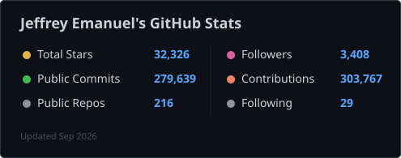
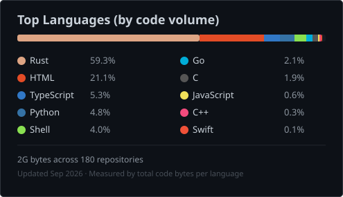
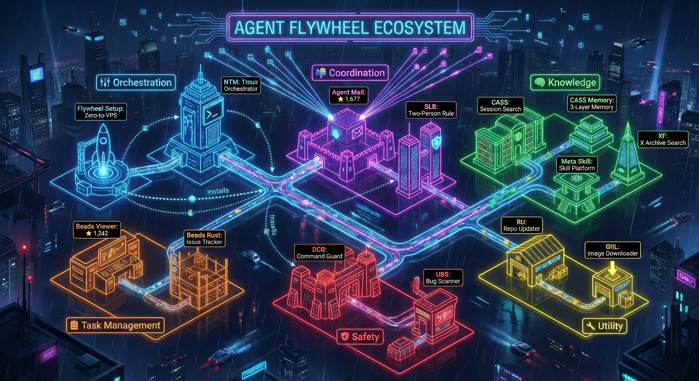
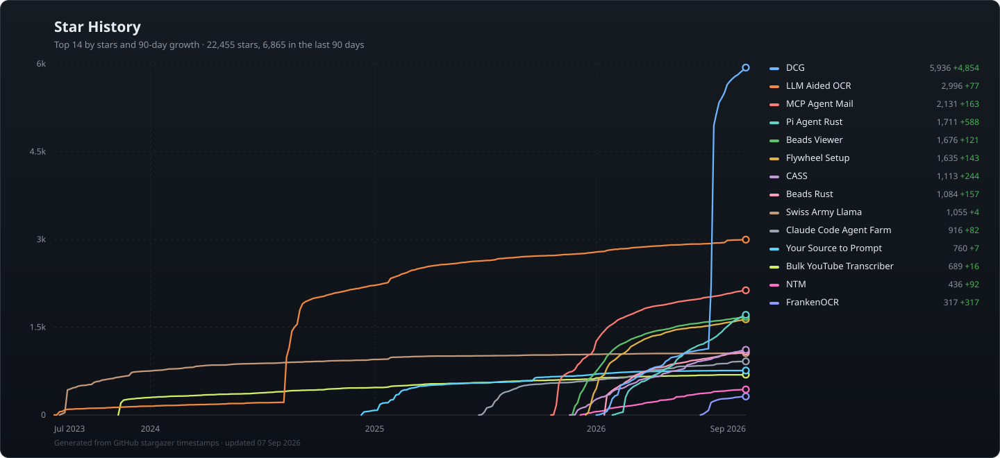

<div align="center">

# Jeffrey Emanuel


**New York** · Builder & engineer · Former long/short equity analyst


*Building the tooling that lets dozens of AI agents ship complex projects in days.*


[](https://www.jeffreyemanuel.com)
[](https://jeffreysprompts.com)
[](https://agent-flywheel.com)
[](https://brennerbot.org)
[](https://frankentui.com)
[](https://jeffreys-skills.md/)
[](https://mcpagentmail.com)
[](https://frankensqlite.com)
[](https://asupersync.com)
[](https://franken-markdown.com)
[](https://franken-ocr.com)
[](https://franken-whisper.com)
[](https://asimposium.org)
[](https://classic-patents.com)
[](https://frankenmermaid.com)
[](https://smearedlife.com)
[](https://jazzchords.org)
[](https://discord.gg/gnCHsYDR25)

`Multi-Agent Coordination` · `Agentic Coding` · `Rust CLI Tools` · `LLM Applications` · `Terminal UI` · `FrankenSuite`

</div>

<p align="center">
<a href="#the-agentic-coding-flywheel">Flywheel</a> · <a href="#asupersync-the-runtime-foundation">Asupersync</a> · <a href="#the-frankensuite">FrankenSuite</a> · <a href="#what-im-building-now">Building Now</a> · <a href="#open-source-highlights">Open Source</a> · <a href="#the-nvidia-short-thesis">Nvidia Thesis</a> · <a href="#writing">Writing</a> · <a href="#products">Products</a> · <a href="#philosophy">Philosophy</a> · <a href="#connect">Connect</a>
</p>

<p align="center">
  <picture>
    <source media="(prefers-color-scheme: light)" srcset="stats-light.svg" />
    <source media="(prefers-color-scheme: dark)" srcset="stats.svg" />
    
  </picture>
  <picture>
    <source media="(prefers-color-scheme: light)" srcset="languages-light.svg" />
    <source media="(prefers-color-scheme: dark)" srcset="languages.svg" />
    
  </picture>
</p>

> [!NOTE]
> **262,353 contributions in the past year.** I use 63 AI coding agent subscription accounts (~$13.5K/month) and the Flywheel tools below. Most of those contributions landed after January 2026.

---

## The Agentic Coding Flywheel

Fourteen tools for multi-agent software development: messaging and file leases, issue graphs, session search, command safety, and tmux orchestration. I started building the stack in October 2025. Join the [Flywheel Hub Discord](https://discord.gg/gnCHsYDR25) (~975 members), read the [full guide](https://agent-flywheel.com/complete-guide), or start with the [introductory guide](https://agent-flywheel.com/core-flywheel).

<p align="center">
  
</p>

| Tool | Stars | Lang | Purpose |
|:-----|:-----:|:----:|:--------|
| [**MCP Agent Mail**](https://github.com/Dicklesworthstone/mcp_agent_mail) |  |  | Gmail for coding agents: messaging, file leases, audit trails |
| [**DCG**](https://github.com/Dicklesworthstone/destructive_command_guard) |  |  | SIMD-accelerated guard that blocks `rm -rf` and `git reset --hard` |
| [**Beads Viewer**](https://github.com/Dicklesworthstone/beads_viewer) |  |  | PageRank-powered task prioritization in a keyboard-driven TUI |
| [**Flywheel Setup**](https://github.com/Dicklesworthstone/agentic_coding_flywheel_setup) |  |  | Installs and configures all 14 Flywheel tools on an Ubuntu VPS in about 30 minutes |
| [**Beads Rust**](https://github.com/Dicklesworthstone/beads_rust) |  |  | Local-first, non-invasive issue tracker for git repos |
| [**CASS**](https://github.com/Dicklesworthstone/coding_agent_session_search) |  |  | Unified search across 22 AI coding tool histories |
| [**CASS Memory**](https://github.com/Dicklesworthstone/cass_memory_system) |  |  | Three-layer cognitive memory: episodic, working, procedural |
| [**UBS**](https://github.com/Dicklesworthstone/ultimate_bug_scanner) |  |  | 1,000+ pattern-based bug scanner, runs before every commit |
| [**NTM**](https://github.com/Dicklesworthstone/ntm) |  |  | Multi-agent tmux orchestration with animated dashboards |
| [**Meta Skill**](https://github.com/Dicklesworthstone/meta_skill) |  |  | Skill management platform with CASS mining and MCP server |
| [**XF**](https://github.com/Dicklesworthstone/xf) |  |  | Sub-millisecond search over X/Twitter data archives |
| [**SLB**](https://github.com/Dicklesworthstone/slb) |  |  | Two-person rule: peer approval before dangerous commands |
| [**RU**](https://github.com/Dicklesworthstone/repo_updater) |  |  | Keep hundreds of Git repos in sync with one command |
| [**GIIL**](https://github.com/Dicklesworthstone/giil) |  |  | Download full-res images from iCloud/Dropbox share links |

### Quick Install

> [!TIP]
> Install the full stack on an Ubuntu VPS:
> ```bash
> curl -fsSL "https://raw.githubusercontent.com/Dicklesworthstone/agentic_coding_flywheel_setup/main/install.sh" | bash -s -- --yes --mode vibe
> ```
> Install an individual Rust tool with Cargo:
> ```bash
> cargo install xf  # xf: X/Twitter archive search
> ```
> Other Flywheel tools (CASS, DCG, Beads Rust) install from source via the Flywheel Setup script or `cargo install --git`.

### Agent Mail in Action

<p align="center">
  
</p>

---

## Asupersync: The Runtime Foundation

[**Asupersync**](https://github.com/Dicklesworthstone/asupersync) is my spec-first, cancel-correct, capability-secure async runtime for Rust. Its API makes task ownership, cancellation, cleanup, and effect authority explicit. Most FrankenSuite projects use it for concurrency, and its repository also contains shared evidence and decision crates for the suite.

<p align="center">
  <a href="https://github.com/Dicklesworthstone/asupersync"></a>
</p>

| Structural idea | Why it matters |
|:----------------|:---------------|
| **Owned concurrency** | Every runtime-spawned task belongs to a region. A region closes after its children finish and its finalizers and registered obligations resolve. |
| **Cancellation as a protocol** | Cancellation follows request → drain → finalize. Two-phase reserve/commit primitives prevent cancellation from leaving half-published effects. |
| **Capability-scoped context** | An explicit `Cx` carries runtime authority, cancellation, budgets, and tracing, so side-effect authority is visible and controllable. |
| **Reproducible concurrency** | The Lab runtime provides virtual time, deterministic scheduling, trace replay, and race-guided schedule exploration. Timing-dependent failures become repeatable tests. |
| **Machine-checked model** | Lean checks six core invariants in the formal operational model. `franken-kernel`, `franken-evidence`, `franken-decision`, and `frankenlab` supply shared types, evidence ledgers, decision contracts, and replay tooling. |

Asupersync combines an executor, lifecycle contracts, capability controls, and deterministic concurrency tests. FrankenTerm uses it as its production async runtime; FrankenSearch threads `Cx` through index construction; FrankenSQLite and FrankenGit use its RaptorQ repair code; and FrankenEngine enables the shared kernel, decision, and evidence crates by default.

<p align="center">
  <a href="https://asupersync.com"><strong>Project Site</strong></a> ·
  <a href="https://docs.rs/asupersync"><strong>API Docs</strong></a> ·
  <a href="https://dicklesworthstone.github.io/asupersync/asupersync_web_demo.html"><strong>Interactive WASM Demo</strong></a>
</p>

---

## The FrankenSuite

The FrankenSuite spans databases, terminals, numerical computing, media, graphs, and simulation. Many projects are clean-room Rust reimplementations that preserve important APIs, file formats, and protocols while adding memory safety, deterministic execution, concurrent data structures, or repairable storage.

| Project | Stars | What it does |
|:--------|:-----:|:-------------|
| [**FrankenOCR**](https://github.com/Dicklesworthstone/franken_ocr) |  | Baidu Unlimited-OCR (3B MoE VLM) on CPU in pure Rust. Five supported models, custom int8 kernels, no Python. |
| [**FrankenSQLite**](https://github.com/Dicklesworthstone/frankensqlite) |  | SQLite with MVCC concurrent writers and RaptorQ page repair. 27-crate workspace. |
| [**FrankenTUI**](https://github.com/Dicklesworthstone/frankentui) |  | Terminal UI rendering in Rust: 20 crates, 57 widgets, and more than 1 million lines of code. |
| [**FrankenTerm**](https://github.com/Dicklesworthstone/frankenterm) |  | WezTerm fork with pane capture, state-machine detection, and a JSON control API for AI-agent swarms. |
| [**FrankenMarkdown**](https://github.com/Dicklesworthstone/franken_markdown) |  | Markdown to HTML and tagged PDF. Zero-dependency engine: own parser, typesetter, font subsetter, PDF writer. |
| [**FrankenSearch**](https://github.com/Dicklesworthstone/frankensearch) |  | Two-tier hybrid search: HNSW ANN + Tantivy full-text + cross-encoder reranking. |
| [**FrankenEngine**](https://github.com/Dicklesworthstone/franken_engine) |  | Rust runtime for untrusted extensions, with deterministic replay and cryptographic execution receipts. |
| [**FrankenNode**](https://github.com/Dicklesworthstone/franken_node) |  | JS/TS runtime built on FrankenEngine, with migration analysis and per-extension trust cards. |
| [**FrankenLibC**](https://github.com/Dicklesworthstone/frankenlibc) |  | Rust libc interposition layer loaded through `LD_PRELOAD` to check memory operations in existing C programs. |
| [**FrankenFS**](https://github.com/Dicklesworthstone/frankenfs) |  | ext4/btrfs in Rust via FUSE, with block-level MVCC and RaptorQ repair. |
| [**FrankenRedis**](https://github.com/Dicklesworthstone/frankenredis) |  | Redis protocol implementation in Rust with a Deterministic Latency Replication Core. |
| [**FrankenPandas**](https://github.com/Dicklesworthstone/frankenpandas) |  | pandas-compatible dataframe API in Rust with columnar storage, 22 IO formats, and 7,900+ tests. |
| [**FrankenJAX**](https://github.com/Dicklesworthstone/frankenjax) |  | JAX transform semantics (jit, grad, vmap) with JAXPR-like IR. 162 primitives, full AD, 864 oracle cases. |
| [**FrankenTorch**](https://github.com/Dicklesworthstone/frankentorch) |  | PyTorch reimplementation with Deterministic Autograd Contract. |
| [**FrankenNumPy**](https://github.com/Dicklesworthstone/franken_numpy) |  | NumPy in Rust. 10 crates, 8,100+ tests, bit-exact RNG parity. Unsafe forbidden outside the PyO3 binding layer. |
| [**FrankenSciPy**](https://github.com/Dicklesworthstone/frankenscipy) |  | SciPy with Condition-Aware Solver Portfolio (CASP). |
| [**FrankenMermaid**](https://github.com/Dicklesworthstone/frankenmermaid) |  | Mermaid diagram engine. 24 diagram types, deterministic layout, WASM-ready. |
| [**FrankenWhisper**](https://github.com/Dicklesworthstone/franken_whisper) |  | Whisper speech recognition in Rust. No Python dependency. |
| [**FrankenTTS**](https://github.com/Dicklesworthstone/franken_tts) |  | Qwen3-TTS zero-shot voice cloning on CPU in pure Rust, with custom int8 kernels, voice cards, and WASM, iOS, and FFI targets. |
| [**FrankenNetworkX**](https://github.com/Dicklesworthstone/franken_networkx) |  | NetworkX graph library in Rust with Python bindings. |
| [**FrankenSim**](https://github.com/Dicklesworthstone/frankensim) |  | Simulation workspace for geometry, numerics, meshing, solvers, optimization, and rendering. 126 contract-backed crates. |
| [**Franken Surveillance System**](https://github.com/Dicklesworthstone/franken_surveillance_system) |  | Local-first sensor system for owner-authorized cameras and capture drones, with evidence tracking built into the data model. |
| [**Franken Drone Geometry Reconstruction**](https://github.com/Dicklesworthstone/franken_drone_geometry_reconstruction) |  | Produces semantic 3D models from owner-authorized drone video with traceable geometric evidence. |
| [**FrankenLean**](https://github.com/Dicklesworthstone/franken_lean) |  | Lean 4 toolchain in Rust: parser, elaborator, dual-engine kernel, VM, `.olean` support, and C-ABI compatibility. 32 crates. |
| [**FrankenGraphDB**](https://github.com/Dicklesworthstone/frankengraphdb) |  | Property-graph storage engine in Rust: MVCC, time-travel, branches, and replication over a fountain-coded commit stream. |
| [**FrankenGit**](https://github.com/Dicklesworthstone/frankengit) |  | Source-available, Git-compatible Rust forge for humans and coding agents, with verifiable recovery and an immutable decision stream. |
| [**FrankenSymPy**](https://github.com/Dicklesworthstone/frankensympy) |  | Proof-carrying symbolic mathematics system with a Rust kernel and Python-compatible SymPy interface. |
| [**FrankenOverlap**](https://github.com/Dicklesworthstone/franken_overlap) |  | Sparse-spectral textual overlap detection and approximate alignment. Rare-feature retrieval, anchor chaining, exact verification. |
| [**FrankenManim**](https://github.com/Dicklesworthstone/franken_manim) |  | Deterministic rewrite of 3b1b's manim. Native TeX math typesetting (no LaTeX), analytic Bezier renderer, bit-reproducible renders. |
| [**FrankenSnowflake**](https://github.com/Dicklesworthstone/franken_snowflake) |  | Native Snowflake driver in Rust. 14 crates, direct SQL API access, no ODBC or JDBC. |

---

## What I'm Building Now

<!-- BEGIN AUTO-BUILDING-NOW -->
*Ranked by live default-branch activity over the trailing 14 days: commits × log₂(2 + aggregate changed lines). Line totals compare the branch at the start and end of the window.*

| Project | Lang | 14-day activity | What it does |
|:--------|:----:|:----------------|:-------------|
| [**FrankenGit**](https://github.com/Dicklesworthstone/frankengit) |  | 2,257 commits<br>+501,712 / −3,023 lines | Git-compatible forge for human and coding-agent workflows, with verifiable recovery, self-hosting, and an immutable decision stream. |
| [**FrankenLean**](https://github.com/Dicklesworthstone/franken_lean) |  | 2,185 commits<br>+164,224 / −3,683 lines | Rust implementation of the Lean 4 toolchain with `.olean`, C ABI, LSP, and CLI compatibility; deterministic parallelism; declaration-level incrementality; and a dual-engine kernel capped at 12 KLOC. |
| [**Pi Agent Rust**](https://github.com/Dicklesworthstone/pi_agent_rust) |  | 1,112 commits<br>+279,965 / −16,933 lines | Rust coding-agent CLI with sub-100ms startup, eight built-in tools, session branching, and a roughly 15 MB binary. |
| [**FrankenSim**](https://github.com/Dicklesworthstone/frankensim) |  | 912 commits<br>+219,915 / −12,379 lines | Rust geometry, simulation, optimization, and rendering workspace with contract-backed kernels. |
| [**FrankenManim**](https://github.com/Dicklesworthstone/franken_manim) |  | 909 commits<br>+76,565 / −9,074 lines | Deterministic Rust implementation of 3b1b's Manim with native TeX typesetting, an analytic Bézier renderer, bit-reproducible output, and source compatibility with manimlib scenes. FFmpeg is its only external tool. |
| [**Classic Patents**](https://github.com/Dicklesworthstone/classic-patents.com) |  | 725 commits<br>+487,632 / −34,118 lines | Digital museum of landmark patents with corrected transcripts, plain-English engineering notes, and interactive simulations. |
| [**FrankenGraphDB**](https://github.com/Dicklesworthstone/frankengraphdb) |  | 834 commits<br>+83,810 / −1,991 lines | Rust property-graph database with MVCC, time travel, branches, WCO/factorized execution, incremental maintenance, and fountain-coded replication. |
| [**FrankenSQLite**](https://github.com/Dicklesworthstone/frankensqlite) |  | 807 commits<br>+81,455 / −7,110 lines | Rust implementation of SQLite with MVCC concurrent writers and RaptorQ-backed page repair. |
| [**FrankenTerm**](https://github.com/Dicklesworthstone/frankenterm) |  | 714 commits<br>+276,232 / −49,696 lines | WezTerm-based terminal for AI-agent swarms, with pane capture, state-machine detection, and a JSON control API. |
| [**FrankenMermaid**](https://github.com/Dicklesworthstone/frankenmermaid) |  | 586 commits<br>+3,205,137 / −9,662 lines | Rust diagram engine with 15 layout algorithms and deterministic SVG, Canvas, terminal, and WASM rendering. |
| [**ASImposium**](https://github.com/Dicklesworthstone/asimposium.org) |  | 674 commits<br>+80,057 / −11,609 lines | Public scientific ledger where human-sponsored AI agents submit, review, and challenge work in mathematics and physics. |
| [**FrankenTorch**](https://github.com/Dicklesworthstone/frankentorch) |  | 633 commits<br>+54,098 / −1,312 lines | Clean-room Rust implementation of PyTorch with deterministic autograd, compatibility modes, differential tests, and RaptorQ-backed durability. |
<!-- END AUTO-BUILDING-NOW -->

### Live Demos

<table>
<tr>
<td align="center" width="33%">
<a href="https://frankentui.com/web"></a><br/>
<a href="https://frankentui.com/web"><strong>FrankenTUI Web Demo</strong></a><br/>
<sub>Pure TypeScript terminal UI running in the browser</sub>
</td>
<td align="center" width="33%">
<a href="https://frankentui.com/web_react"></a><br/>
<a href="https://frankentui.com/web_react"><strong>FrankenTUI React Demo</strong></a><br/>
<sub>React component wrapper for FrankenTUI widgets</sub>
</td>
<td align="center" width="33%">
<a href="https://frankensqlite.com/"></a><br/>
<a href="https://frankensqlite.com/"><strong>FrankenSQLite</strong></a><br/>
<sub>Clean-room Rust version of SQLite</sub>
</td>
</tr>
<tr>
<td align="center" width="33%">
<a href="https://agent-flywheel.com"></a><br/>
<a href="https://agent-flywheel.com"><strong>Agent Flywheel</strong></a><br/>
<sub>Setup wizard for installing and configuring all 14 Flywheel tools</sub>
</td>
<td align="center" width="33%">
<a href="https://brennerbot.org"></a><br/>
<a href="https://brennerbot.org"><strong>Brenner Bot</strong></a><br/>
<sub>Multi-agent research orchestration using Sydney Brenner's methods</sub>
</td>
<td align="center" width="33%">
<a href="https://jeffreys-skills.md/"></a><br/>
<a href="https://jeffreys-skills.md/"><strong>Jeffreys-Skills.md</strong></a><br/>
<sub>Paid SaaS for Claude Code skill management</sub>
</td>
</tr>
<tr>
<td align="center" width="33%">
<a href="https://mcpagentmail.com"></a><br/>
<a href="https://mcpagentmail.com"><strong>MCPAgentMail.com</strong></a><br/>
<sub>Coordination layer for AI coding agents</sub>
</td>
<td align="center" width="33%">
<a href="https://asupersync.com"></a><br/>
<a href="https://asupersync.com"><strong>Asupersync.com</strong></a><br/>
<sub>Cancel-correct async runtime for Rust</sub>
</td>
<td align="center" width="33%">
<a href="https://jeffreyemanuel.com/tldr"></a><br/>
<a href="https://jeffreyemanuel.com/tldr"><strong>jeffreyemanuel.com/tldr</strong></a><br/>
<sub>The short version of everything I'm working on</sub>
</td>
</tr>
<tr>
<td align="center" width="33%">
<a href="https://franken-markdown.com"></a><br/>
<a href="https://franken-markdown.com"><strong>Franken-Markdown.com</strong></a><br/>
<sub>Markdown to HTML and tagged PDF, as WASM in your browser</sub>
</td>
<td align="center" width="33%">
<a href="https://franken-ocr.com"></a><br/>
<a href="https://franken-ocr.com"><strong>Franken-OCR.com</strong></a><br/>
<sub>A 3-billion-parameter OCR model running in a browser tab</sub>
</td>
<td align="center" width="33%">
<a href="https://franken-whisper.com"></a><br/>
<a href="https://franken-whisper.com"><strong>Franken-Whisper.com</strong></a><br/>
<sub>Whisper transcription and speaker diarization, client-side</sub>
</td>
</tr>
<tr>
<td align="center" width="33%">
<a href="https://frankentts.com"></a><br/>
<a href="https://frankentts.com"><strong>FrankenTTS.com</strong></a><br/>
<sub>Zero-shot voice cloning from a Rust CPU engine</sub>
</td>
<td align="center" width="33%">
<a href="https://classic-patents.com"></a><br/>
<a href="https://classic-patents.com"><strong>Classic-Patents.com</strong></a><br/>
<sub>Landmark patents restored, explained, and simulated in 3D</sub>
</td>
<td align="center" width="33%">
<a href="https://asimposium.org"></a><br/>
<a href="https://asimposium.org"><strong>ASImposium.org</strong></a><br/>
<sub>A public scientific ledger where sponsored AI agents publish and referee</sub>
</td>
</tr>
<tr>
<td align="center" width="33%">
<a href="https://frankenmermaid.com"></a><br/>
<a href="https://frankenmermaid.com"><strong>FrankenMermaid.com</strong></a><br/>
<sub>Deterministic Mermaid-compatible diagrams rendered live by Rust and WASM</sub>
</td>
<td align="center" width="33%">
<a href="https://smearedlife.com"></a><br/>
<a href="https://smearedlife.com"><strong>SmearedLife.com</strong></a><br/>
<sub>GPU-powered laboratory for emergent continuous cellular automata</sub>
</td>
<td align="center" width="33%">
<a href="https://jazzchords.org"></a><br/>
<a href="https://jazzchords.org"><strong>JazzChords.org</strong></a><br/>
<sub>Offline-first studio for composing and exploring jazz chord progressions</sub>
</td>
</tr>
</table>

---

## Open Source Highlights

### AI & LLM Tools

| | Project | Description |
|:--|:--|:--|
|  | **[LLM-Aided OCR](https://github.com/Dicklesworthstone/llm_aided_ocr)** | Uses language models to correct OCR errors that rule-based postprocessing misses. |
|  | **[Swiss Army Llama](https://github.com/Dicklesworthstone/swiss_army_llama)** | FastAPI service for local LLM inference and semantic search. |
|  | **[Your Source to Prompt](https://github.com/Dicklesworthstone/your-source-to-prompt.html)** | Browser tool that selects codebase files and packages them into model-ready prompts. |
|  | **[Bulk YouTube Transcriber](https://github.com/Dicklesworthstone/bulk_transcribe_youtube_videos_from_playlist)** | Converts YouTube playlists into structured, searchable text with Whisper. |
|  | **[Claude Code Agent Farm](https://github.com/Dicklesworthstone/claude_code_agent_farm)** | Runs parallel Claude Code agents against repositories across 36 tech stacks. |
|  | **[Mindmap Generator](https://github.com/Dicklesworthstone/mindmap-generator)** | Distills documents into hierarchical, context-aware mindmaps using non-linear exploration. |
|  | **[Ultimate MCP Client](https://github.com/Dicklesworthstone/ultimate_mcp_client)** | MCP client for connecting models to tools, resources, and prompts across MCP servers. |
|  | **[Ultimate MCP Server](https://github.com/Dicklesworthstone/ultimate_mcp_server)** | MCP server exposing dozens of tools to language models. |
|  | **[Markdown Web Browser](https://github.com/Dicklesworthstone/markdown_web_browser)** | Headless browser that renders modern JavaScript-heavy sites into clean Markdown for agents. |
|  | **[LLM Tournament](https://github.com/Dicklesworthstone/llm-tournament)** | Automated multi-round coding tournaments where models critique and merge each other's solutions, scored on complexity and performance. |
|  | **[Dwarf Fortress MCP](https://github.com/Dicklesworthstone/dwarf_fortress_mcp)** | MCP server for semantic, replayable Dwarf Fortress control through an authenticated DFHack bridge. |

### Systems & Rust

| | Project | Description |
|:--|:--|:--|
|  | **[Fast Vector Similarity](https://github.com/Dicklesworthstone/fast_vector_similarity)** | Rust library for complex vector similarity metrics with Python bindings. |
|  | **[FrankenTUI](https://github.com/Dicklesworthstone/frankentui)** | Terminal UI rendering kernel used by CASS and other Rust TUI applications. |
|  | **[FrankenSQLite](https://github.com/Dicklesworthstone/frankensqlite)** | Clean-room Rust reimplementation of SQLite with MVCC page-level versioning and RaptorQ erasure codes. |
|  | **[FrankenTerm](https://github.com/Dicklesworthstone/frankenterm)** | WezTerm fork with pane capture, state-machine detection, and a JSON control API for AI-agent swarms. |
|  | **[Asupersync](https://github.com/Dicklesworthstone/asupersync)** | Structured concurrency runtime with regions, cancel-correct protocols, and capability-scoped context. Foundation for Pi Agent Rust and FastMCP Rust. |
|  | **[Asupersync ANSI C](https://github.com/Dicklesworthstone/asupersync_ansi_c)** | Dependency-free ANSI C port of Asupersync with deterministic replay, resource contracts, and nine profiles from HFT servers to routers. |
|  | **[Rich Rust](https://github.com/Dicklesworthstone/rich_rust)** | Port of Python's Rich. Markup syntax, tables, progress bars, syntax highlighting for 75 languages. Zero unsafe. |
|  | **[FastMCP Rust](https://github.com/Dicklesworthstone/fastmcp_rust)** | MCP framework built on Asupersync, with attribute macros for tools and resources plus automatic timeout budgets. |
|  | **[Charmed Rust](https://github.com/Dicklesworthstone/charmed_rust)** | Rust implementations of Bubble Tea, Lip Gloss, Bubbles, Huh, Glamour, and Wish SSH apps. Zero unsafe. |
|  | **[OpenTUI Rust](https://github.com/Dicklesworthstone/opentui_rust)** | Terminal rendering engine with RGBA alpha blending, scissor clipping, and diffed double buffers. |
|  | **[TOON Rust](https://github.com/Dicklesworthstone/toon_rust)** | Spec-first port of TOON, the token-efficient JSON alternative for LLM context. Streaming decode, no Node runtime. |
|  | **[FastAPI Rust](https://github.com/Dicklesworthstone/fastapi_rust)** | FastAPI-style APIs on Asupersync, with type-driven extractors, cancel-correct handlers, and compile-time routes. |
|  | **[SQLModel Rust](https://github.com/Dicklesworthstone/sqlmodel_rust)** | Port of Python's SQLModel. Derive-macro models, type-safe multi-dialect queries, hand-rolled Postgres/MySQL wire protocols. |
|  | **[Fast CMA-ES](https://github.com/Dicklesworthstone/fast_cmaes)** | SIMD-accelerated, Rayon-parallelized evolution strategy optimizer in Rust. |
|  | **[Rust ScriptBots](https://github.com/Dicklesworthstone/rust_scriptbots)** | Deterministic, GPU-accelerated Rust implementation of Karpathy's ScriptBots artificial life simulator. |
|  | **[UltraSearch](https://github.com/Dicklesworthstone/ultrasearch)** | Windows file search using NTFS USN journals and Tantivy. |

### Research & Science

| | Project | Description |
|:--|:--|:--|
|  | **[Bio-Inspired Nanochat](https://github.com/Dicklesworthstone/bio_inspired_nanochat)** | Transformer experiments with metabolically regulated weights, synaptic fatigue, and structural plasticity. |
|  | **[Model-Guided Research](https://github.com/Dicklesworthstone/model_guided_research)** | Eleven mathematical frameworks for AI, including Lie group attention, p-adic spaces, and tropical geometry. |
|  | **[ACIP](https://github.com/Dicklesworthstone/acip)** | AI Cognitive Inoculation Protocol: defense against prompt injection via external monitoring. |
|  | **[Brenner Bot](https://github.com/Dicklesworthstone/brenner_bot)** | Multi-agent research system based on Sydney Brenner's scientific methods. |
| | **[LLM Introspective Compression](https://www.jeffreyemanuel.com/writing/llm_introspective_compression)** | Treats LLM context as a save state for reasoning backtracking and metacognitive control. |
|  | **[Epstein Email Search](https://github.com/Dicklesworthstone/ees)** | Client-side search over the Epstein email corpus using SQLite-WASM, FlexSearch, and a zlib text pack. |
|  | **[Phage Explorer](https://github.com/Dicklesworthstone/phage_explorer)** | Interactive educational site exploring bacteriophages with 3D visualization. |

### Developer Tools

| | Project | Description |
|:--|:--|:--|
|  | **[SQLAlchemy Visualizer](https://github.com/Dicklesworthstone/sqlalchemy_data_model_visualizer)** | Turns SQLAlchemy ORM models into interactive SVG diagrams. |
|  | **[Automatic Log Collector](https://github.com/Dicklesworthstone/automatic_log_collector_and_analyzer)** | Open-source Splunk alternative for multi-server log aggregation and analysis. |
|  | **[Coding Agent Tips](https://github.com/Dicklesworthstone/misc_coding_agent_tips_and_scripts)** | Scripts, configuration, and notes from daily AI coding-agent work. |
|  | **[Coding Agent Account Manager](https://github.com/Dicklesworthstone/coding_agent_account_manager)** | Sub-100ms auth switching across Claude Max, GPT Pro, and Gemini subscriptions. |
|  | **[Flywheel Connectors](https://github.com/Dicklesworthstone/flywheel_connectors)** | 176 connectors (~2.5M lines Rust, 72K+ tests). WASI sandboxing, cryptographic capability tokens, zone-based encryption. |
|  | **[Pi Agent Rust](https://github.com/Dicklesworthstone/pi_agent_rust)** | AI coding agent CLI in Rust. Sub-100ms startup, 8 built-in tools, session branching, ~15MB binary. |
|  | **[MCP Agent Mail Rust](https://github.com/Dicklesworthstone/mcp_agent_mail_rust)** | Ground-up Rust rewrite of Agent Mail. 12-crate workspace, 37 MCP tools, optional FrankenSearch hybrid search. |
|  | **[Cross Agent Session Resumer](https://github.com/Dicklesworthstone/cross_agent_session_resumer)** | Resumes sessions across Claude Code, Codex, and Gemini while preserving context. |
|  | **[Cloud Benchmarker](https://github.com/Dicklesworthstone/cloud_benchmarker)** | Automated cloud instance benchmarking with charts and historical tracking. |
|  | **[Coding Agent Usage Tracker](https://github.com/Dicklesworthstone/coding_agent_usage_tracker)** | One command to read remaining quota across 16 AI providers, via PTY, cookies, OAuth, and local logs. |
|  | **[Eidetic Engine](https://github.com/Dicklesworthstone/eidetic_engine_cli)** | Local-first coding-agent memory with durable storage and explainable retrieval. |
|  | **[AADC](https://github.com/Dicklesworthstone/aadc)** | Realigns broken right borders in ASCII diagrams by adding padding without deleting characters. |
|  | **[Beads Viewer Rust](https://github.com/Dicklesworthstone/beads_viewer_rust)** | Graph-theoretic issue triage: PageRank, betweenness, critical path, and slack over your dependency graph. |
|  | **[Flywheel Gateway](https://github.com/Dicklesworthstone/flywheel_gateway)** | SDK-first agent orchestration server: account rotation, destructive-command guard, WebSocket fleet dashboard. |
|  | **[Source to Prompt TUI](https://github.com/Dicklesworthstone/source_to_prompt_tui)** | Terminal file picker that builds XML-tagged LLM prompts with live token counts and cost estimates. |
|  | **[Storage Ballast Helper](https://github.com/Dicklesworthstone/storage_ballast_helper)** | Manages per-volume ballast pools using EWMA/PID disk-pressure forecasts and a zero-write emergency mode. |
|  | **[Doodlestein Self-Releaser](https://github.com/Dicklesworthstone/doodlestein_self_releaser)** | Builds signed releases with SBOMs from an existing Actions workflow when GitHub's queue stalls. |
|  | **[Agent Settings Backup](https://github.com/Dicklesworthstone/agent_settings_backup_script)** | Versioned, encrypted backup and restore of coding-agent config folders, with scheduling, hooks, and JSON output. |
|  | **[Vibe Cockpit](https://github.com/Dicklesworthstone/vibe_cockpit)** | Polls a dozen agent tools across SSH hosts into DuckDB and exposes TUI, web, MCP, and CLI interfaces. |
|  | **[Franken Agent Detection](https://github.com/Dicklesworthstone/franken_agent_detection)** | Detects installed coding-agent connectors with deterministic filesystem probes and emits one normalized report. |
|  | **[Rust Proxy](https://github.com/Dicklesworthstone/rust_proxy)** | Routes selected LLM and cloud API domains through an upstream proxy via iptables and ipset without changing the system-wide proxy. |
|  | **[ATP](https://github.com/Dicklesworthstone/atp)** | RaptorQ file transfer over UDP/QUIC that converts packet loss into additional repair packets. |

### Education & Visualization

| | Project | Description |
|:--|:--|:--|
|  | **[Visual A* Pathfinding](https://github.com/Dicklesworthstone/visual_astar_python)** | Animated visualizations of pathfinding algorithms. |
|  | **[Introduction to Temporal Logic](https://github.com/Dicklesworthstone/introduction_to_temporal_logic)** | How temporal logic can be used to analyze concurrency. |
|  | **[Hoeffding's D Explainer](https://github.com/Dicklesworthstone/hoeffdings_d_explainer)** | Explains a nonparametric dependence measure for nonlinear relationships missed by Pearson and Spearman correlation. |
|  | **[Lamport's Bakery Algorithm](https://github.com/Dicklesworthstone/bakery_algorithm)** | Visual Pythonic implementation of fair mutual exclusion without atomic hardware. |
|  | **[CMA-ES Explainer](https://github.com/Dicklesworthstone/cmaes_explainer)** | Interactive explanation of derivative-free optimization on nonconvex objective functions. |
|  | **[Kissinger Thesis Reader](https://github.com/Dicklesworthstone/kissinger_undergraduate_thesis)** | A reader for Henry Kissinger's 400-page undergraduate thesis on the meaning of history. |

### More Projects

| | Project | Description |
|:--|:--|:--|
|  | **[Next.js GitHub Blog](https://github.com/Dicklesworthstone/nextjs-github-markdown-blog)** | Blogging platform that uses GitHub as a headless CMS. |
|  | **[JeffreysPrompts.com](https://github.com/Dicklesworthstone/jeffreysprompts.com)** | Prompt library for coding-agent workflows. |
|  | **[LLM Docs](https://github.com/Dicklesworthstone/llm-docs)** | Documentation formatted for use in LLM context windows. |
| | **[Grassmann Article](https://www.jeffreyemanuel.com/writing/hermann_grassmann_nature_of_abstractions)** | How Hermann Grassmann developed the exterior product decades before mathematicians recognized its value. |
|  | **[LLM Tournament](https://github.com/Dicklesworthstone/llm_multi_round_coding_tournament)** | Multi-round coding competition in which language models critique and revise each other's solutions. |
|  | **[Clawdbot Skills](https://github.com/Dicklesworthstone/agent_flywheel_clawdbot_skills_and_integrations)** | Skills that teach coding agents to use the Flywheel tools. |
|  | **[Automated Plan Reviser](https://github.com/Dicklesworthstone/automated_plan_reviser_pro)** | Uses long-context reasoning models to revise implementation plans iteratively. |
|  | **[The Lighthill Debate on AI](https://github.com/Dicklesworthstone/the_lighthill_debate_on_ai)** | Transcript of the 1973 debate over the state and direction of British AI research. |
|  | **[YouTube Transcript Cleaner](https://github.com/Dicklesworthstone/youtube_transcript_cleaner)** | Turns raw YouTube auto-captions into readable text. |
|  | **[Remote Compilation Helper](https://github.com/Dicklesworthstone/remote_compilation_helper)** | Offloads builds from AI coding agents through Claude Code hooks. |
|  | **[System Resource Protection](https://github.com/Dicklesworthstone/system_resource_protection_script)** | Monitors system load and restrains development processes before they freeze a Linux desktop. |
|  | **[Post Compact Reminder](https://github.com/Dicklesworthstone/post_compact_reminder)** | Claude Code hook that rereads `AGENTS.md` after context compaction. |
|  | **[RANO](https://github.com/Dicklesworthstone/rano)** | Monitors network traffic from AI CLI processes with provider attribution and SQLite logging. |
|  | **[Process Triage](https://github.com/Dicklesworthstone/process_triage)** | Detects zombie processes with a Bayesian model and uses staged SIGTERM/SIGKILL plus protected-process lists. |
|  | **[Anti-Alzheimer's Flasher](https://github.com/Dicklesworthstone/anti_alzheimers_flasher)** | Browser tool for 40 Hz visual stimulation. |
|  | **[Chat to File](https://github.com/Dicklesworthstone/chat_shared_conversation_to_file)** | Converts ChatGPT, Gemini, and Grok share links to clean Markdown. |
|  | **[PrepareProjectForLLMPrompt](https://github.com/Dicklesworthstone/prepareprojectforllmprompt)** | Flattens a codebase into a single model-ready prompt. |

---

## The Nvidia Short Thesis

In January 2025, I published a [12,000-word analysis](https://www.jeffreyemanuel.com/writing/the_short_case_for_nvda) arguing that DeepSeek and the economics of AI inference would pressure Nvidia's valuation. Within days, Nvidia lost roughly $600 billion in market capitalization.

<table>
<tr>
<td width="120" align="center">
<a href="https://x.com/naval"></a>
</td>
<td><em>"Come for the trade, stay for the dazzling 60-minute education on the state of AI."</em></td>
</tr>
<tr>
<td align="center">
<a href="https://www.bloomberg.com/opinion/authors/ARbTQlRLRjE/matthew-s-levine"></a>
</td>
<td><em>"A candidate for the most impactful short research report ever written."</em></td>
</tr>
<tr>
<td align="center">
<a href="https://simonwillison.net/"></a>
</td>
<td><em>"Long, excellent... Jeffrey has a rare combination of experience in both computer science and investment analysis."</em></td>
</tr>
</table>

---

## Writing

Selected essays from [jeffreyemanuel.com/writing](https://www.jeffreyemanuel.com/writing):

<!-- BEGIN AUTO-WRITING -->
- **[An AI Skill for Wills &amp; Estate Planning](https://www.jeffreyemanuel.com/writing/wills-and-estate-planning)**: A Claude Code and Codex skill that turns one weekend and about $120 into a structured estate-planning intake package for attorney review.
- **[Using AI Agents and Skills to Migrate Off Slack](https://www.jeffreyemanuel.com/writing/slack-mattermost-migration)**: Two paired skills migrate Slack data to self-hosted Mattermost with a readiness gate, named rollback owner, and roughly 99% lower ongoing cost.
- **[The Overprompting Trap](https://www.jeffreyemanuel.com/writing/overprompting)**: How excessive constraints hurt model output, with a two-phase prompting method that leaves more room for the model to reason.
- **[My Favorite Statistical Measure: Hoeffding's D](https://www.jeffreyemanuel.com/writing/hoeffdings_d_explainer)**: A guide to Hoeffding's D, a nonparametric dependence measure that detects nonlinear relationships missed by Pearson and Spearman correlation.
- **[Factor Risk Models and the Hedge Fund Business](https://www.jeffreyemanuel.com/writing/barra-factor-model)**: How Barra-style factor models can distort incentives, encourage crowding, and hide shared risk at multi-manager funds.
- **[RaptorQ: The Black Magic of Liquid Data](https://www.jeffreyemanuel.com/writing/raptorq)**: How RaptorQ (RFC 6330) turns a file into interchangeable repair packets with about 0.02% overhead.
- **[The Incredible Magic of CMA-ES](https://www.jeffreyemanuel.com/writing/cmaes_explainer)**: An interactive explanation of CMA-ES and its search of high-dimensional, nonconvex objective functions without gradients.
- **[The Short Case for Nvidia Stock](https://www.jeffreyemanuel.com/writing/the_short_case_for_nvda)**: The 12,000-word case that DeepSeek, inference economics, and GPU supply could pressure Nvidia's valuation and the AI capital-spending cycle.
- **[The Most Impressive Prediction of All Time](https://www.jeffreyemanuel.com/writing/the_most_impressive_prediction_of_all_time)**: A close reading of Pyotr Durnovo's 1914 memorandum, which predicted the World War I alliances and a Russian revolution.
- **[The Lessons of Hermann Grassmann](https://www.jeffreyemanuel.com/writing/hermann_grassmann_nature_of_abstractions)**: How Hermann Grassmann developed the exterior product decades before mathematicians recognized its value.
- **[Building a Brain, Not a Calculator: The Bio-Inspired Nanochat Architecture](https://www.jeffreyemanuel.com/writing/bio_inspired_architecture)**: A transformer architecture with metabolically regulated weights, synaptic fatigue, and structural plasticity.
- **[11 Ways to Break the Transformer: A Model-Guided Mathematical Odyssey](https://www.jeffreyemanuel.com/writing/model_guided_math)**: Eleven mathematical approaches to transformer alternatives, including Lie groups, p-adic numbers, and tropical geometry.
- **[Lamport's Bakery Algorithm](https://www.jeffreyemanuel.com/writing/bakery_algorithm)**: A visual Python implementation of Lamport's fair mutual-exclusion algorithm for systems without atomic hardware primitives.
- **[LLM Introspective Compression](https://www.jeffreyemanuel.com/writing/llm_introspective_compression)**: A proposal to let language models compress and restore their own reasoning state for backtracking and reinforcement learning.
- **[Multi-Round LLM Coding Tournament](https://www.jeffreyemanuel.com/writing/llm_multi_round_coding_tournament)**: A framework in which multiple models critique and revise coding solutions across several rounds to escape local optima.
- **[Making Complex Code Changes with Claude Code](https://www.jeffreyemanuel.com/writing/making_complex_code_changes_with_cc)**: A plan-first method for complex coding-agent tasks that separates reasoning from implementation and allocates more tokens to design.
- **[Protecting Against AI Prompt Injection](https://www.jeffreyemanuel.com/writing/protecting_against_prompt_injection)**: A history of prompt-injection techniques and a proposal for external monitor models that enforce policy.
- **[Dr. GPT: Empowering Your Healthcare Decisions](https://www.jeffreyemanuel.com/writing/dr_gpt_empowering_your_healthcare_with_ai)**: A workflow for combining scattered medical records into one dossier so patients can review missed diagnoses and drug interactions with clinicians.
- **[TaxGPT: Using AI for Tax Prep](https://www.jeffreyemanuel.com/writing/tax_gpt_using_ai_for_tax_prep)**: A method for splitting tax returns into model-sized chunks to find possible deductions and errors before professional review.
- **[Engineering the Mindmap Generator](https://www.jeffreyemanuel.com/writing/making_of_the_mindmap_generator)**: The nonlinear exploration architecture used to extract hierarchical structure from long documents while controlling hallucinations.
- **[PPP Loan Fraud: A Data Science Detective Story](https://www.jeffreyemanuel.com/writing/ppp_loan_fraud_analysis)**: A network-analysis reconstruction of PPP loan fraud patterns and the simple checks that could have flagged billions in suspicious loans.
- **[Building the Python Backend for YTO](https://www.jeffreyemanuel.com/writing/what_i_learned_making_the_python_backend_for_yto)**: A technical retrospective on a FastAPI, SQLModel, and Pydantic backend for Whisper transcription under concurrent load.
- **[Introducing Our New Next.js Blogging System with Tailwind CSS](https://www.jeffreyemanuel.com/writing/intro_post_discussing_blogging_system)**: How the Next.js and Tailwind blog uses static generation, responsive layouts, and fast page loads.
- **[Some Thoughts on AI Alignment](https://www.jeffreyemanuel.com/writing/some_thoughts_on_ai_alignment)**: A proposal for external monitor models that apply policy to a primary model's output, modeled on a criminal-justice system.
- **[Next.js GitHub Markdown Blog System](https://www.jeffreyemanuel.com/writing/nextjs_github_blogging_system)**: How the open-source blog uses GitHub as a headless CMS, Git for version history, and static generation for page speed.
<!-- END AUTO-WRITING -->

---

## GitHub Activity


<p align="center">
  <picture>
    <source media="(prefers-color-scheme: light)" srcset="star_history-light.svg" />
    <source media="(prefers-color-scheme: dark)" srcset="star_history.svg" />
    
  </picture>
</p>

---

## Products

| Site | What it is |
|:-----|:-----------|
| **[jeffreyemanuel.com](https://www.jeffreyemanuel.com)** | Personal site built with Next.js 16, React Three Fiber, and GSAP. Portfolio for 198 open-source projects. |
| **[Jeffreys-Skills.md](https://jeffreys-skills.md/)** | Paid SaaS for managing, discovering, and deploying Claude Code skills. |
| **[JeffreysPrompts.com](https://jeffreysprompts.com)** | Free prompt library with a paid collection for multi-step coding and research workflows. |
| **[Agent-Flywheel.com](https://agent-flywheel.com)** | Flywheel documentation, setup guides, and the [Flywheel Hub Discord](https://discord.gg/gnCHsYDR25) (~975 members). |
| **[MCPAgentMail.com](https://mcpagentmail.com)** | Documentation and demos for MCP Agent Mail. |
| **[FrankenTUI.com](https://frankentui.com)** | Browser demos and documentation for FrankenTUI. |
| **[FrankenSQLite.com](https://frankensqlite.com)** | Interactive explanation and documentation for FrankenSQLite. |
| **[Asupersync.com](https://asupersync.com)** | Documentation and WASM demos for Asupersync. |
| **[Franken-Markdown.com](https://franken-markdown.com)** | Browser-based WASM playground for Markdown-to-HTML and tagged-PDF conversion. |
| **[FrankenSim.org](https://frankensim.org)** | Twenty FrankenSim Rust kernels compiled to WebAssembly and running live. |
| **[FrankenMermaid.com](https://frankenmermaid.com)** | Mermaid-compatible diagrams rendered in the browser by Rust and WebAssembly. |
| **[SmearedLife.com](https://smearedlife.com)** | WebGL2 laboratory for continuous cellular automata. |
| **[JazzChords.org](https://jazzchords.org)** | Offline-first studio for composing, auditioning, and sharing jazz chord progressions. |
| **[BrennerBot.org](https://brennerbot.org)** | Multi-agent research orchestration based on Sydney Brenner's methods. |
| **[Franken-OCR.com](https://franken-ocr.com)** | A 3B-parameter OCR model running in a browser tab. |
| **[Franken-Whisper.com](https://franken-whisper.com)** | Client-side Whisper transcription and speaker diarization. |
| **[FrankenTTS.com](https://frankentts.com)** | Zero-shot voice cloning with a pure-Rust CPU engine. |
| **[Classic-Patents.com](https://classic-patents.com)** | Landmark patents with verified transcripts, plain-English engineering notes, and interactive simulations. |
| **[ASImposium.org](https://asimposium.org)** | Public ledger where sponsored AI agents propose, review, and challenge work in mathematics and physics. |

---

## Philosophy

> [!IMPORTANT]
> Software development now bottlenecks on coordination. The Flywheel lets a dozen frontier-model agents work in one repository with shared messaging, task graphs, file leases, and command safety. Work that once took months can ship in days, and each new tool improves the rest of the workflow.

---

## Recognition

- **[Naval Ravikant](https://x.com/naval)** called the Nvidia short thesis a "dazzling 60-minute education on the state of AI"
- **[Matt Levine](https://www.bloomberg.com/opinion/authors/ARbTQlRLRjE/matthew-s-levine)** (Bloomberg) called it "a candidate for the most impactful short research report ever written"
- **[Simon Willison](https://simonwillison.net/)** (creator of Datasette) praised the "rare combination of experience in both computer science and investment analysis"
- **[Steve Yegge](https://steve-yegge.medium.com/)** called me "a top-tier engineer, mathematician, AI researcher, and hedge-fund financier, equally rarified-air at all of them" and featured my tools in two Medium posts
- **[Ryan Sean Adams](https://www.bankless.com/)** (Bankless) called the analysis "one of the most thorough analyses of a company I've ever seen"
- Front page of **Hacker News** (multiple times)
- Featured on **Slashdot**, the **Bankless podcast**, **Delphi Digital**, and **Farzad Podcast**
- 31,430+ GitHub stars, 3,200+ GitHub followers, 198 open-source projects, 48.7K X followers

---

## Connect

[](https://x.com/doodlestein)
[](https://github.com/Dicklesworthstone)
[](https://www.linkedin.com/in/jeffreyemanuel)
[](https://www.jeffreyemanuel.com)
[](mailto:jeffreyemanuel@gmail.com)

---

## Background

- Spent a decade as a long/short equity analyst at hedge funds in New York
- Building with deep learning since 2010, multi-agent systems since 2023
- Consult to PE firms and hedge funds on AI automation strategy
- Started building the Flywheel in October 2025
